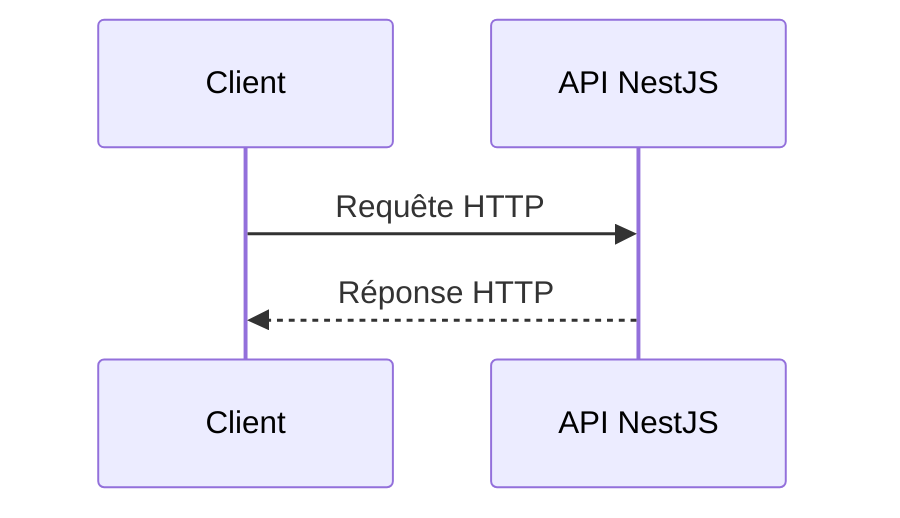

+++
draft = false
title = '📘 Rappel : Serveur et requêtes HTTP'
weight = 21
+++

## **Role du serveur**


## **Le protocole HTTP**

HTTP (**HyperText Transfer Protocol**) est un protocole de communication utilisé
pour échanger des données entre un client et un serveur.

Le client envoie une **requête HTTP** et le serveur retourne une
**réponse HTTP**.



Un client HTTP peut être :

- un navigateur;
- une application Web ou mobile;
- Postman;
- un script;
- un capteur;
- un autre serveur.

> Dans le projet fil conducteur, les clients pourront notamment être :
> - le simulateur de capteurs;
> - une interface de consultation;
> - Postman;
> - un traitement automatisé.

Le serveur sera une API développée avec NestJS.

> HTTP fonctionne généralement selon un modèle requête-réponse. Il est aussi
> considéré comme un protocole sans état : chaque requête doit contenir les
> informations nécessaires à son traitement.

---

## **Parties d'une Requête HTTP**


- **URL (Uniform Resource Locator)**: L'adresse de la ressource demandée.
    - **Exemple**: `https://api.example.com/users/123`
    - Cette URL accède à la ressource utilisateur avec l'ID 123.
- **Méthode HTTP**: Le verbe HTTP utilisé pour la requête (GET, POST, etc.).

- **En-têtes (Headers)**: Informations supplémentaires sur la requête.

- **Corps (Body)**: Contenu de la requête (souvent utilisé avec POST et PUT).
    - **Exemple**:
        
        ```json
        {
          "username": "johndoe",
          "email": "john@example.com"
        }
        ```
        
    - Le corps contient les données envoyées au serveur pour créer ou mettre à jour une ressource.


### 1. URL
Une URL permet d’identifier une ressource accessible sur un réseau.

```text
http://localhost:3000/api/buildings/42?includeRooms=true
```

| Partie | Valeur |
|---|---|
| Protocole | `http` |
| Hôte | `localhost` |
| Port | `3000` |
| Chemin | `/api/buildings/42` |
| Paramètre de requête | `includeRooms=true` |

Dans une requête HTTP/1.1, la première ligne contient habituellement le chemin
et les paramètres :

```http
GET /api/buildings/42?includeRooms=true HTTP/1.1
```

### Paramètre de route

```text
/api/buildings/42
```

Ici, `42` identifie un bâtiment précis.

### Paramètre de requête

```text
/api/buildings?city=Montreal
```

Ici, `city=Montreal` sert à filtrer les résultats.

> La partie située après un symbole `#`, appelée fragment, est utilisée par le
> client et n’est normalement pas transmise au serveur HTTP.

### 2. Méthodes HTTP (GET, POST, PUT, DELETE)
Une méthode HTTP indique l’intention de la requête.

| Méthode | Utilisation habituelle | Exemple |
|---|---|---|
| `GET` | Consulter une ou plusieurs ressources | Consulter les bâtiments |
| `POST` | Créer une ressource ou déclencher un traitement | Créer un bâtiment |
| `PUT` | Remplacer complètement une ressource | Remplacer les données d’un bâtiment |
| `PATCH` | Modifier partiellement une ressource | Modifier le nom d’un bâtiment |
| `DELETE` | Supprimer une ressource | Supprimer un capteur |
| `OPTIONS` | Connaître les options de communication | Vérification CORS préalable |
| `HEAD` | Obtenir les en-têtes sans le corps de réponse | Vérifier une ressource |

### Exemples appliqués au projet

```
GET /api/buildings
```

Consulter tous les bâtiments.

```
GET /api/buildings/42
```

Consulter le bâtiment `42`.

```
POST /api/buildings
```

Créer un bâtiment.

```
PATCH /api/buildings/42
```

Modifier une partie du bâtiment `42`.

```
DELETE /api/buildings/42
```

Supprimer le bâtiment `42`.


### 3. En-têtes (Headers)
Ce sont des **paires clé-valeur** qui fournissent des informations supplémentaires sur la requête.

* **Obligatoires** : `Host` (nom du serveur).
* **Optionnels** : `User-Agent`, `Content-Type`, `Accept`, `Authorization`, etc.

**Exemple** :

```
Host: www.exemple.com
User-Agent: Mozilla/5.0
Accept: text/html
```
Les en-têtes optionnels servent à transmettre des informations complémentaires destinées au serveur, afin de préciser ou d’adapter le traitement de la requête.

 **Exemple complet**:
    
```http
POST /api/buildings HTTP/1.1
Host: localhost:3000
Accept: application/json
Content-Type: application/json
Authorization: Bearer jeton-exemple

{
  "name": "Pavillon principal",
  "address": "7000, rue Marie-Victorin"
}
```

Dans cet exemple :

| Partie | Valeur | Signification |
|---|---|---|
| Méthode | `POST` | Demande la création d’une ressource |
| Chemin | `/api/buildings` | Désigne la collection de bâtiments |
| Version | `HTTP/1.1` | Indique la version du protocole |
| `Host` | `localhost:3000` | Identifie le serveur ciblé |
| `Accept` | `application/json` | Indique le format de réponse accepté |
| `Content-Type` | `application/json` | Indique le format du corps envoyé |
| `Authorization` | `Bearer ...` | Transmet éventuellement un jeton |
| Corps | Objet JSON | Contient les données du bâtiment |

#### Exemples d'entêtes :
| En-tête             | Exemple                               | Rôle                                                                    |
| ------------------- | ------------------------------------- | ----------------------------------------------------------------------- |
| **Host**            | `Host: www.exemple.com`               | Indique le nom de domaine du serveur demandé (obligatoire en HTTP/1.1). |
| **User-Agent**      | `User-Agent: Mozilla/5.0`             | Fournit des infos sur le client (navigateur, OS, version).              |
| **Accept**          | `Accept: text/html, application/json` | Indique les formats de réponse que le client peut accepter.             |
| **Content-Type**    | `Content-Type: application/json`      | Spécifie le format des données envoyées au serveur.                     |
| **Content-Length**  | `Content-Length: 256`                 | Taille du corps de la requête (en octets).                              |
| **Authorization**   | `Authorization: Bearer <token>`       | Transmet un jeton ou identifiant pour authentifier le client.           |
| **Cookie**          | `Cookie: sessionId=xyz`               | Envoie des données de session ou de suivi au serveur.                   |
| **Cache-Control**   | `Cache-Control: no-cache`             | Indique comment gérer la mise en cache des ressources.                  |
| **Referer**         | `Referer: https://google.com`         | Indique la page d’où vient la requête.                                  |
| **Accept-Language** | `Accept-Language: fr-FR`              | Spécifie la langue préférée du client.                                  |

#### Filtres d'Origines des Requêtes (CORS)

- **CORS (Cross-Origin Resource Sharing)** : Un mécanisme qui permet au serveur de spécifier quelles origines (domaines) peuvent accéder à ses ressources.

Une origine est déterminée par la combinaison :

- du protocole;
- du nom d’hôte;
- du port.

- **Exemple**: Si une application JavaScript sur `https://frontend.example.com` veut faire une requête vers `https://api.example.com`, mais que CORS n'est pas configuré, le navigateur bloquera la requête.
- **Solution avec CORS**: Le serveur `https://api.example.com` peut configurer CORS pour autoriser les requêtes provenant de `https://frontend.example.com` :

Ces deux adresses n’ont pas la même origine :

```text
http://localhost:5173
http://localhost:3000
```

Le port est différent.

Si une application Web chargée depuis `http://localhost:5173` tente d’appeler
une API située sur `http://localhost:3000`, le navigateur applique les règles
CORS.

Le serveur doit indiquer si cette origine est autorisée à lire la réponse.

### 4. Corps
Le corps contient les données transmises au serveur.

Il est fréquemment utilisé avec :

- `POST`;
- `PUT`;
- `PATCH`.

### Exemple JSON

```json
{
  "name": "Pavillon principal",
  "address": "7000, rue Marie-Victorin",
  "yearBuilt": 2005
}
```

Le serveur doit vérifier :

- que le corps est présent lorsqu’il est requis;
- que le format annoncé correspond au contenu;
- que le JSON est valide;
- que les propriétés obligatoires sont fournies;
- que les valeurs respectent les règles de validation.

La validation complète avec des DTO sera approfondie ultérieurement.

[Que'est-ce qu'une API REST](https://www.youtube.com/watch?v=-mN3VyJuCjM)
