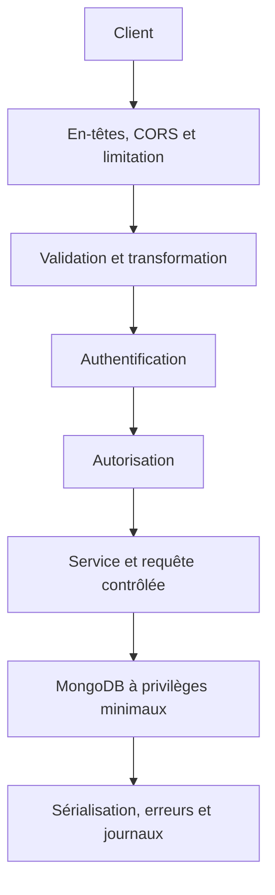

+++
draft = false
title = '📘 Sécurité des API et de MongoDB'
weight = 81
+++

## 1. Comprendre ce qu'on protège

### 1.1 Les actifs à protéger

Un **actif** est une donnée, une fonction ou une infrastructure qui a de la valeur et qui doit être protégée.

Dans `energy-api`, les actifs comprennent notamment :

- les bâtiments et les locaux;
- les mesures produites par les capteurs;
- les comptes et les rôles des utilisateurs;
- les jetons d’accès;
- l’URI de connexion MongoDB;
- les fonctions administratives;
- la disponibilité de l’API et de la base de données;
- les journaux pouvant contenir des renseignements opérationnels.

### 1.2 Confidentialité, intégrité et disponibilité

| Propriété | Question | Exemple dans `energy-api` |
|---|---|---|
| Confidentialité | Qui peut lire la donnée? | Un utilisateur non autorisé ne doit pas consulter les mesures d’un autre site. |
| Intégrité | Qui peut modifier la donnée? | Un lecteur ne doit pas modifier la capacité d’un local. |
| Disponibilité | Le service demeure-t-il accessible? | Un client ne doit pas saturer l’API avec des milliers de requêtes. |

La sécurité ne se limite donc pas au vol de données. Une modification non autorisée ou un déni de service constitue également un incident.

### 1.3 Menace, vulnérabilité et risque

- Une **menace** est une action susceptible de causer un dommage.
- Une **vulnérabilité** est une faiblesse exploitable.
- Le **risque** combine la probabilité d’exploitation et l’impact potentiel.

Exemple : un attaquant modifie l’identifiant d’un bâtiment dans l’URL. Si l’API vérifie seulement que le jeton est valide, mais pas que l’utilisateur peut accéder à ce bâtiment, l’absence de contrôle d’autorisation constitue la vulnérabilité.

### 1.4 Modèle de menace minimal

Avant de coder un contrôle de sécurité, on doit répondre à ces questions :

1. Quelle ressource est exposée?
2. Qui devrait pouvoir la lire ou la modifier?
3. Quelles données proviennent du client?
4. Quel dommage entraînerait une consultation, une modification ou une suppression abusive?
5. Comment détecterait-on l’incident?


## 2. Les risques OWASP appliqués à `energy-api`

Le **OWASP API Security Top 10** regroupe des risques fréquemment observés dans les API. Il ne s’agit pas d’une liste de correctifs à appliquer mécaniquement, mais d’un guide pour analyser la surface d’attaque.

| Risque | Exemple | Contrôle attendu |
|---|---|---|
| Autorisation au niveau de l’objet défaillante | Lire un bâtiment en remplaçant son identifiant dans l’URL | Vérifier l’accès à chaque objet demandé |
| Authentification défaillante | Accepter un jeton expiré ou mal signé | Valider signature, expiration et paramètres du jeton |
| Autorisation au niveau des propriétés défaillante | Un client modifie `role` ou `createdAt` | DTO dédiés, liste blanche et projection de sortie |
| Consommation non limitée | Demander une collection sans limite ou marteler une route | Limitation de débit, pagination et limites de taille |
| Autorisation au niveau des fonctions défaillante | Un lecteur appelle une route d’administration | Garde de rôle ou de permission |
| Flux métier sensible non protégé | Automatiser l’envoi massif de mesures | Quotas, règles métier et surveillance |
| SSRF | Faire récupérer une URL de capteur arbitraire par le serveur | Liste d’hôtes autorisés et validation stricte des URL |
| Mauvaise configuration | Swagger ou MongoDB exposé publiquement | Configuration par environnement et surface minimale |
| Mauvaise gestion de l’inventaire | Une ancienne version vulnérable demeure accessible | Inventaire des versions et retrait planifié |
| Consommation non sécurisée d’une API tierce | Faire confiance à une réponse externe non validée | Valider aussi les données provenant d’autres services |

Référence : [OWASP API Security Top 10 — 2023](https://owasp.org/API-Security/editions/2023/en/0x11-t10/).


## 3. Défense en profondeur dans NestJS

Aucun mécanisme ne suffit à lui seul. Une requête devrait franchir plusieurs contrôles avant d’atteindre la base de données (MongoDB).



Dans NestJS, ces responsabilités se répartissent généralement ainsi :

| Mécanisme | Rôle principal |
|---|---|
| Middleware | Traiter la requête avant le routage, par exemple les en-têtes ou l’identifiant de corrélation |
| Pipe | Valider et transformer les entrées |
| Guard | Décider si la requête peut atteindre une route |
| Interceptor | Encadrer l’exécution et transformer une réponse |
| Exception filter | Normaliser les erreurs retournées au client |
| Service | Appliquer les règles métier et construire des requêtes contrôlées |
| Schéma MongoDB | Assurer les contraintes finales de persistance |


## 4. Validation des entrées

### 4.1 La validation n’est pas l’autorisation

Une valeur `buildingId` peut être un identifiant MongoDB valide sans désigner un bâtiment accessible à l’utilisateur. Il faut donc effectuer les deux contrôles :

1. vérifier le format de l’identifiant;
2. vérifier que l’appelant a le droit d’accéder à l’objet correspondant.

### 4.2 Configurer un `ValidationPipe` global

```ts
// src/main.ts
app.useGlobalPipes(
  new ValidationPipe({
    whitelist: true,
    forbidNonWhitelisted: true,
    transform: true,
  }),
);
```

- `whitelist` retire les propriétés sans décorateur de validation;
- `forbidNonWhitelisted` rejette explicitement ces propriétés;
- `transform` convertit le corps reçu en instance de DTO et permet certaines conversions typées.

> Pour un projet professionnel, le rejet explicite est préférable au retrait silencieux : il informe le client que son contrat est incorrect.

### 4.3 N’accepter que les propriétés modifiables

Le DTO ne doit pas reproduire automatiquement toutes les propriétés du document MongoDB.

```ts
export class CreateRoomDto {
  @IsString()
  @Matches(/^[A-Z]-\d{3}$/)
  code: string;

  @IsMongoId()
  buildingId: string;

  @IsInt()
  @Min(0)
  floor: number;

  @IsEnum(RoomType)
  type: RoomType;

  @IsInt()
  @Min(1)
  @Max(1000)
  capacity: number;
}
```

Le client ne devrait pas pouvoir soumettre des propriétés gérées par le serveur comme `_id`, `createdAt`, `updatedAt`, `role` ou `ownerId`.

### 4.4 Valider les paramètres et les requêtes

La validation ne concerne pas seulement le corps JSON.

```ts
@Get(':id')
findOne(@Param('id', ParseMongoIdPipe) id: string) {
  return this.roomsService.findById(id);
}
```

Pour la pagination, on impose aussi des bornes :

```ts
export class ListRoomsQueryDto {
  @Type(() => Number)
  @IsInt()
  @Min(1)
  page = 1;

  @Type(() => Number)
  @IsInt()
  @Min(1)
  @Max(100)
  limit = 20;
}
```

Une limite maximale protège la mémoire, le processeur, la bande passante et MongoDB.

### 4.5 Validation en plusieurs couches

| Couche | Responsabilité |
|---|---|
| DTO | Format de la requête HTTP |
| Service | Cohérence métier, par exemple l’existence du bâtiment |
| Schéma Mongoose | Contraintes de persistance et index uniques |
| MongoDB | Intégrité finale, index et validation de collection au besoin |

Dupliquer une contrainte essentielle à la frontière HTTP et dans la base est acceptable : les deux couches ne protègent pas contre les mêmes défaillances.


## 5. Prévenir les injections NoSQL

### 5.1 Comprendre le risque

MongoDB utilise des objets pour exprimer ses requêtes. Une injection NoSQL apparaît lorsque l’application transmet directement à MongoDB une structure contrôlée par le client.

Code dangereux :

```ts
return this.roomModel.find(req.body).exec();
```

Le client pourrait envoyer des opérateurs MongoDB plutôt que de simples valeurs. Le problème n’est pas MongoDB lui-même : c’est l’absence de frontière entre les données du client et le langage de requête.

### 5.2 Construire la requête avec une liste blanche

```ts
const filter: FilterQuery<Room> = {};

if (query.buildingId !== undefined) {
  filter.buildingId = new Types.ObjectId(query.buildingId);
}

if (query.type !== undefined) {
  filter.type = query.type;
}

return this.roomModel
  .find(filter)
  .limit(query.limit)
  .skip((query.page - 1) * query.limit)
  .exec();
```

Principes :

- ne jamais transmettre directement `body`, `query` ou `params` à `find`, `update` ou `aggregate`;
- valider le type de chaque valeur;
- autoriser explicitement les champs filtrables et triables;
- ne pas accepter un pipeline d’agrégation fourni par le client;
- éviter les fonctions serveur dynamiques telles que `$where`;
- activer les protections offertes par la version utilisée de Mongoose, sans les considérer comme un remplacement de la liste blanche.

### 5.3 Contrôler le tri

Code à éviter :

```ts
query.sort(req.query.sort);
```

Approche contrôlée :

```ts
const allowedSorts = new Set(['code', 'floor', 'capacity']);

if (!allowedSorts.has(query.sortBy)) {
  throw new BadRequestException('Champ de tri non autorisé.');
}
```


## 6. Authentification

### 6.1 Définition

L’**authentification** répond à la question : « Qui effectue la requête? »

Dans une API NestJS, un flux courant est :

1. l’utilisateur présente ses identifiants;
2. le serveur vérifie le mot de passe haché;
3. le serveur émet un jeton d’accès signé;
4. un guard valide le jeton sur les routes protégées;
5. l’identité validée est attachée à la requête.

### 6.2 Mots de passe

Un mot de passe ne doit jamais être :

- enregistré en clair;
- chiffré de manière réversible pour l’authentification;
- inscrit dans un journal;
- retourné par l’API, même sous forme hachée.

Il doit être transformé avec une fonction de hachage conçue pour les mots de passe, par exemple Argon2id, avec les paramètres appropriés à l’environnement.

```ts
const passwordHash = await argon2.hash(password, {
  type: argon2.argon2id,
});
```

### 6.3 Jetons d’accès

Un JWT signé n’est pas chiffré. Son contenu peut généralement être lu par le client. Il ne faut donc pas y placer de secret.

Le serveur doit vérifier au minimum :

- la signature;
- l’expiration;
- l’émetteur attendu;
- l’audience attendue;
- l’algorithme autorisé;
- les propriétés nécessaires à l’autorisation.

Le secret ou la clé de signature doit provenir de la configuration sécurisée, jamais du dépôt Git.

### 6.4 Réponses d’authentification

Une erreur de connexion ne devrait pas révéler si le nom d’utilisateur existe.

Préférer un message générique :

```json
{
  "status": 401,
  "title": "Authentification requise",
  "detail": "Les informations d’authentification sont invalides."
}
```

Référence : [Authentification avec NestJS](https://docs.nestjs.com/security/authentication).


## 7. Autorisation

### 7.1 Définition

L’**autorisation** répond à la question : « Cette identité peut-elle effectuer cette action sur cette ressource? »

Un utilisateur authentifié ne possède pas automatiquement tous les droits.

### 7.2 Autorisation au niveau de la fonction

Exemple de politique :

| Action | Lecteur | Gestionnaire | Administrateur |
|---|:---:|:---:|:---:|
| Consulter un bâtiment autorisé | Oui | Oui | Oui |
| Créer ou modifier un local | Non | Oui | Oui |
| Supprimer un bâtiment | Non | Non | Oui |

Un guard peut appliquer les rôles ou, mieux encore, des permissions explicites telles que `rooms:read` et `rooms:write`.

### 7.3 Autorisation au niveau de l’objet

Ce contrôle est indispensable lorsqu’un identifiant provient du client.

```ts
const room = await this.roomModel.findById(id).exec();

if (!room) {
  throw new NotFoundException();
}

if (!user.allowedBuildingIds.includes(room.buildingId.toString())) {
  throw new ForbiddenException();
}
```

Dans certains contextes, on combine l’autorisation directement à la requête :

```ts
const room = await this.roomModel.findOne({
  _id: id,
  buildingId: { $in: user.allowedBuildingIds },
});
```

Cette forme réduit le risque d’oublier le contrôle après la lecture. Le choix entre `403` et `404` dépend de la politique de divulgation : retourner `404` peut éviter de confirmer l’existence d’une ressource inaccessible.

### 7.4 Autorisation au niveau des propriétés

Même si l’utilisateur peut modifier un local, il ne devrait pas nécessairement pouvoir modifier toutes ses propriétés. Les DTO d’entrée, les permissions et les projections de sortie doivent refléter cette distinction.

Référence : [Autorisation avec NestJS](https://docs.nestjs.com/security/authorization).


## 8. Sécuriser les mises à jour MongoDB

### 8.1 Utiliser un DTO de mise à jour contrôlé

```ts
export class UpdateRoomDto extends PartialType(CreateRoomDto) {}
```

`PartialType` rend les propriétés facultatives, mais conserve leurs métadonnées de validation et de documentation lorsque l’import provient du paquet NestJS approprié au projet. Les propriétés sensibles ne doivent toutefois pas figurer dans `CreateRoomDto` si elles ne sont jamais modifiables par le client.

### 8.2 Activer la validation lors d’une mise à jour

Avec Mongoose, les opérations de mise à jour doivent demander explicitement l’exécution des validateurs lorsque nécessaire.

```ts
const updatedRoom = await this.roomModel
  .findByIdAndUpdate(id, updateRoomDto, {
    new: true,
    runValidators: true,
  })
  .exec();

if (!updatedRoom) {
  throw new NotFoundException(`Le local ${id} n’existe pas.`);
}

return updatedRoom;
```

### 8.3 Conflits d’unicité

Une contrainte unique doit être garantie par un index MongoDB. Une vérification préalable avec `findOne` peut améliorer le message, mais elle ne remplace pas l’index, car deux requêtes peuvent arriver simultanément.

Une violation de l’index unique doit être transformée en réponse `409 Conflict`, sans retourner la pile d’appel ou le détail interne de MongoDB.


## 9. Sécuriser MongoDB

### 9.1 Le compte de l’application

L’API doit utiliser un compte MongoDB qui lui est propre. Ce compte ne doit pas être administrateur du cluster.

Pour `energy-api`, il devrait posséder uniquement les permissions nécessaires sur sa base, par exemple la lecture et l’écriture des collections applicatives. Les migrations, l’administration et les sauvegardes devraient utiliser des identités distinctes.

### 9.2 Réseau

- ne jamais exposer directement MongoDB à tout Internet;
- limiter les adresses ou réseaux autorisés;
- utiliser TLS pour les communications;
- préférer un réseau privé ou des mécanismes de liaison privée en production;
- ne pas conserver une règle Atlas `0.0.0.0/0` par commodité;
- retirer les accès temporaires devenus inutiles.

### 9.3 Chiffrement

Il faut distinguer :

- le chiffrement **en transit**, assuré par TLS;
- le chiffrement **au repos**, appliqué au stockage;
- le chiffrement **au niveau des champs**, utile pour certaines données particulièrement sensibles.

Le chiffrement ne remplace pas l’autorisation. Un utilisateur autorisé par la base à lire une donnée déchiffrée peut toujours en abuser.

### 9.4 Index et disponibilité

Les index ne servent pas uniquement aux performances. Une requête non indexée sur une grande collection peut devenir un vecteur de déni de service. Les index uniques protègent aussi certaines règles d’intégrité.

Il faut cependant éviter de permettre au client de choisir librement les champs de tri ou de recherche : l’API doit exposer uniquement les opérations prises en charge par ses index et son contrat.

### 9.5 Sauvegardes et restauration

Une sauvegarde inutilisable n’est pas une protection. L’équipe doit :

- chiffrer et protéger les sauvegardes;
- limiter leur accès;
- définir une politique de rétention;
- tester périodiquement la restauration;
- documenter les objectifs de perte de données et de temps de reprise.

Référence : [Liste de vérification de sécurité MongoDB](https://www.mongodb.com/docs/manual/administration/security-checklist/).


## 10. Secrets et configuration

### 10.1 Ce qui constitue un secret

- URI MongoDB contenant des identifiants;
- clé de signature JWT;
- clé d’API d’un fournisseur;
- certificat privé;
- mot de passe d’administration.

### 10.2 Règles essentielles

- ne jamais commiter un fichier `.env` réel;
- fournir un `.env.example` sans valeur secrète;
- valider la configuration au démarrage;
- utiliser un gestionnaire de secrets en déploiement;
- appliquer une rotation périodique et immédiate après une fuite;
- utiliser des secrets distincts selon l’environnement;
- révoquer un secret compromis : le supprimer de Git ne suffit pas.

Exemple de validation au démarrage :

```ts
ConfigModule.forRoot({
  isGlobal: true,
  validationSchema: Joi.object({
    MONGODB_URI: Joi.string().uri().required(),
    JWT_SECRET: Joi.string().min(32).required(),
    PORT: Joi.number().port().required(),
  }),
});
```

L’application doit refuser de démarrer si une configuration de sécurité obligatoire est absente ou invalide.


## 11. En-têtes HTTP, CORS et transport

### 11.1 HTTPS

Une API en production doit être accessible uniquement par HTTPS. TLS protège les données et les jetons pendant leur transport.

### 11.2 Helmet

Helmet configure plusieurs en-têtes HTTP de sécurité.

```ts
import helmet from 'helmet';

app.use(helmet());
```

Il réduit certains risques côté navigateur, mais ne remplace ni la validation, ni l’authentification, ni l’autorisation.

### 11.3 CORS

CORS indique aux navigateurs quelles origines peuvent lire les réponses. Ce n’est pas un mécanisme d’authentification et les clients non navigateur ne sont pas bloqués par CORS.

```ts
app.enableCors({
  origin: ['https://energy.example.ca'],
  methods: ['GET', 'POST', 'PATCH', 'DELETE'],
  allowedHeaders: ['Content-Type', 'Authorization'],
});
```

Éviter une origine générique en production, surtout avec des informations d’identification.

Référence : [Helmet avec NestJS](https://docs.nestjs.com/security/helmet).


## 12. Limiter les abus et les ressources

### 12.1 Limitation de débit

```bash
npm install @nestjs/throttler
```

```ts
ThrottlerModule.forRoot([
  {
    ttl: 60_000,
    limit: 100,
  },
]);
```

Le guard de limitation peut ensuite être enregistré globalement. Les seuils doivent être adaptés aux routes : une connexion, une écriture de mesure et une simple lecture n’ont pas nécessairement le même profil.

### 12.2 Autres limites nécessaires

- taille maximale du corps HTTP;
- nombre maximal d’éléments par page;
- profondeur et complexité des filtres;
- délai maximal pour les appels externes;
- nombre de tentatives de connexion;
- fréquence d’ingestion par capteur;
- durée maximale des traitements;
- quota par utilisateur, client ou clé d’API selon le cas.

La limitation par adresse IP seule peut être insuffisante derrière un proxy ou pour plusieurs utilisateurs partageant une adresse. Le déploiement doit configurer correctement les proxys de confiance et choisir une clé de limitation pertinente.

Référence : [Limitation de débit avec NestJS](https://docs.nestjs.com/security/rate-limiting).


## 13. Erreurs sécuritaires avec `Problem Details`

### 13.1 Objectif

Le client a besoin d’une erreur stable et exploitable. Il n’a pas besoin de connaître :

- la pile d’appel;
- le chemin du fichier source;
- le nom du serveur MongoDB;
- la requête interne;
- le contenu complet d’une erreur Mongoose;
- un secret ou un jeton.

### 13.2 Exemple de réponse

```json
{
  "type": "https://energy-api.example/problems/duplicate-room-code",
  "title": "Conflit de ressource",
  "status": 409,
  "detail": "Un local utilise déjà ce code dans ce bâtiment.",
  "instance": "/api/v1/rooms",
  "traceId": "01J..."
}
```

### 13.3 Correspondance recommandée

| Situation | Statut |
|---|---:|
| Corps ou paramètre invalide | `400 Bad Request` |
| Jeton absent ou invalide | `401 Unauthorized` |
| Identité valide, droit insuffisant | `403 Forbidden` |
| Ressource absente ou volontairement masquée | `404 Not Found` |
| Index unique violé | `409 Conflict` |
| Trop de requêtes | `429 Too Many Requests` |
| Erreur interne inattendue | `500 Internal Server Error` |

Un filtre global peut transformer les exceptions connues en Problem Details et remplacer toute erreur inconnue par un message générique. L’erreur détaillée doit être journalisée côté serveur avec un identifiant de corrélation.

Référence : [RFC 9457 — Problem Details for HTTP APIs](https://datatracker.ietf.org/doc/html/rfc9457).


## 14. Journalisation et surveillance

### 14.1 Pourquoi journaliser

Les journaux permettent de détecter et d’analyser :

- une série d’échecs d’authentification;
- des réponses `403` ou `429` répétées;
- une hausse anormale des suppressions;
- des erreurs MongoDB;
- un changement de configuration;
- une activité administrative inhabituelle.

### 14.2 Données utiles

- date et heure en UTC;
- identifiant de corrélation;
- méthode et modèle de route;
- statut HTTP;
- durée;
- identifiant interne de l’acteur, lorsque permis;
- type d’événement de sécurité;
- résultat de l’action.

### 14.3 Données à ne pas journaliser

- mot de passe;
- jeton JWT complet;
- en-tête `Authorization`;
- URI MongoDB avec identifiants;
- clé d’API;
- corps complet si celui-ci contient des données sensibles;
- détails excessifs permettant une attaque.

Les journaux doivent être centralisés, protégés contre la modification, soumis à une durée de conservation et accompagnés d’alertes. Un journal non surveillé permet seulement une analyse après l’incident.


## 15. Documentation et surface d'attaque

OpenAPI aide à maintenir un inventaire des routes, des schémas, des réponses et des mécanismes d’authentification. Une documentation incomplète peut laisser survivre des endpoints oubliés.

La documentation doit indiquer :

- le mécanisme d’authentification;
- les permissions nécessaires;
- les contraintes des paramètres;
- les réponses `400`, `401`, `403`, `404`, `409` et `429` applicables;
- le schéma Problem Details;
- les limites de pagination et de débit pertinentes.

En production, Swagger UI ne doit pas être publié automatiquement sans décision explicite. Selon le contexte, on peut le désactiver, le placer sur un réseau interne ou le protéger par authentification. Le document OpenAPI n’est pas un substitut au contrôle d’accès des véritables endpoints.


## 16. Dépendances et chaîne d’approvisionnement

Une application sécurisée peut devenir vulnérable à cause d’une dépendance compromise ou obsolète.

Pratiques attendues :

- versionner le fichier de verrouillage;
- mettre les dépendances à jour régulièrement;
- examiner les alertes de vulnérabilité;
- retirer les paquets inutilisés;
- éviter les scripts ou paquets de provenance inconnue;
- séparer les dépendances de production et de développement;
- reconstruire et redéployer après une mise à jour de sécurité;
- conserver une version de Node.js et de MongoDB prise en charge.

`npm audit` est un indicateur utile, mais il ne remplace pas l’analyse de l’exploitabilité, les tests ni la revue de code.


## 17. Étude de cas : sécuriser la modification d’un local

### Mise en situation

L’API `energy-api` reçoit des données provenant de clients, de systèmes administratifs et, éventuellement, de capteurs. Elle conserve notamment des bâtiments, des locaux et des mesures énergétiques dans MongoDB.

Une API fonctionnelle n’est pas automatiquement une API sécurisée. Une donnée peut respecter son format tout en étant envoyée par une personne qui n’a pas le droit de la consulter ou de la modifier. De même, une base MongoDB protégée par un mot de passe demeure vulnérable si l’application accepte des filtres arbitraires, divulgue ses erreurs internes ou utilise un compte trop privilégié.

La sécurité sera donc appliquée à plusieurs couches complémentaires.

Considérons :

```http
PATCH /api/v1/rooms/66f...
Authorization: Bearer <jeton>
Content-Type: application/json

{
  "capacity": 40
}
```

La route devrait appliquer les contrôles suivants :

1. HTTPS protège la requête en transit.
2. La limite de débit réduit les abus.
3. Le corps respecte la taille maximale.
4. Le DTO refuse les propriétés inconnues.
5. L’identifiant respecte le format MongoDB.
6. Le guard authentifie le jeton.
7. Le guard ou le service vérifie la permission de modification.
8. Le service vérifie l’accès à ce local précis.
9. La mise à jour utilise seulement les champs autorisés.
10. Mongoose exécute les validateurs de mise à jour.
11. MongoDB garantit les contraintes uniques.
12. Un conflit devient une réponse `409` sans détail interne.
13. La réponse exclut les propriétés sensibles.
14. Le résultat est journalisé sans enregistrer le jeton.

Cette chaîne illustre la défense en profondeur : si un contrôle est imparfait, les autres continuent de réduire le risque.

## 18. Activité en classe : revue de sécurité

### Consigne

Pour chacune des situations suivantes, relever la vulnérabilité, le risque et au moins un contrôle approprié.

#### Situation A

```ts
@Get()
find(@Query() filter: Record<string, unknown>) {
  return this.roomModel.find(filter);
}
```

#### Situation B

```ts
@Patch(':id')
update(@Param('id') id: string, @Body() body: Room) {
  return this.roomModel.findByIdAndUpdate(id, body);
}
```

#### Situation C

```ts
catch (error) {
  throw new InternalServerErrorException(error);
}
```

#### Situation D

Le compte MongoDB de l’application possède le rôle d’administrateur du cluster et Atlas accepte les connexions depuis `0.0.0.0/0`.

### Résultats attendus

L’analyse devrait notamment faire ressortir :

- l’injection NoSQL et l’absence de liste blanche;
- l’affectation de masse;
- l’absence de validation et d’autorisation;
- la divulgation d’information interne;
- les privilèges excessifs;
- l’exposition réseau inutile.


## 19. Vérification d’`energy-api`

### Frontière HTTP

- [ ] HTTPS est imposé en production.
- [ ] Helmet est activé.
- [ ] CORS contient seulement les origines nécessaires.
- [ ] La taille du corps HTTP est limitée.
- [ ] Une limite de débit appropriée est appliquée.

### Validation

- [ ] Le `ValidationPipe` global utilise une liste blanche.
- [ ] Les propriétés inconnues sont rejetées.
- [ ] Les identifiants MongoDB sont validés.
- [ ] La pagination possède une valeur maximale.
- [ ] Les champs de filtre et de tri sont autorisés explicitement.
- [ ] Aucun objet fourni par le client n’est transmis directement à MongoDB.

### Identité et accès

- [ ] Les routes privées exigent une authentification.
- [ ] Les jetons sont validés complètement et expirent.
- [ ] Les permissions sont vérifiées par fonction.
- [ ] L’accès est vérifié pour chaque objet demandé.
- [ ] Les propriétés sensibles ne sont ni modifiables ni retournées.

### MongoDB

- [ ] L’API utilise un compte distinct et non administrateur.
- [ ] L’accès réseau est restreint.
- [ ] TLS est utilisé.
- [ ] Les index uniques protègent les règles d’intégrité.
- [ ] Les opérations de mise à jour exécutent les validateurs nécessaires.
- [ ] Les sauvegardes sont protégées et leur restauration est testée.

### Exploitation

- [ ] Aucun secret n’est versionné.
- [ ] La configuration est validée au démarrage.
- [ ] Les erreurs suivent un contrat Problem Details.
- [ ] Les détails internes ne sont jamais retournés au client.
- [ ] Les événements de sécurité sont journalisés sans secret.
- [ ] Les dépendances et les versions déployées sont inventoriées.


## 20. Questions de synthèse

1. Pourquoi un DTO valide ne prouve-t-il pas que l’utilisateur est autorisé?
2. Pourquoi `find(req.query)` expose-t-il un risque particulier avec MongoDB?
3. Quelle différence existe entre une réponse `401` et une réponse `403`?
4. Pourquoi un `findOne` préalable ne remplace-t-il pas un index unique?
5. Pourquoi CORS ne protège-t-il pas une API contre tous les clients malveillants?
6. Quelles informations ne devraient jamais apparaître dans les journaux?
7. Pourquoi le compte MongoDB de l’application ne devrait-il pas être administrateur?
8. Quels contrôles empêchent un client de modifier `createdAt` ou `role`?
9. Dans quel cas pourrait-on retourner `404` plutôt que `403`?
10. Pourquoi la restauration d’une sauvegarde doit-elle être testée?


## Résumé

La sécurité d’une API repose sur des contrôles complémentaires :

- **valider** toutes les données reçues, y compris les paramètres et filtres;
- **authentifier** l’identité de l’appelant;
- **autoriser** chaque action, chaque objet et chaque propriété;
- **construire** les requêtes MongoDB à partir d’une liste blanche;
- **limiter** les ressources consommées;
- **isoler** MongoDB avec TLS, un réseau restreint et un compte à privilèges minimaux;
- **protéger** et faire tourner les secrets;
- **normaliser** les erreurs sans divulguer les détails internes;
- **journaliser et surveiller** les événements utiles;
- **maintenir** les dépendances, les versions et la documentation.

La règle centrale est simple : aucune donnée provenant d’un client ou d’un service externe ne doit être considérée comme fiable, et chaque accès doit être limité au strict nécessaire.

## Références principales

- [OWASP API Security Top 10 — 2023](https://owasp.org/API-Security/editions/2023/en/0x11-t10/)
- [MongoDB — Security Checklist](https://www.mongodb.com/docs/manual/administration/security-checklist/)
- [NestJS — Authentication](https://docs.nestjs.com/security/authentication)
- [NestJS — Authorization](https://docs.nestjs.com/security/authorization)
- [NestJS — Helmet](https://docs.nestjs.com/security/helmet)
- [NestJS — Rate limiting](https://docs.nestjs.com/security/rate-limiting)
- [RFC 9457 — Problem Details for HTTP APIs](https://datatracker.ietf.org/doc/html/rfc9457)
