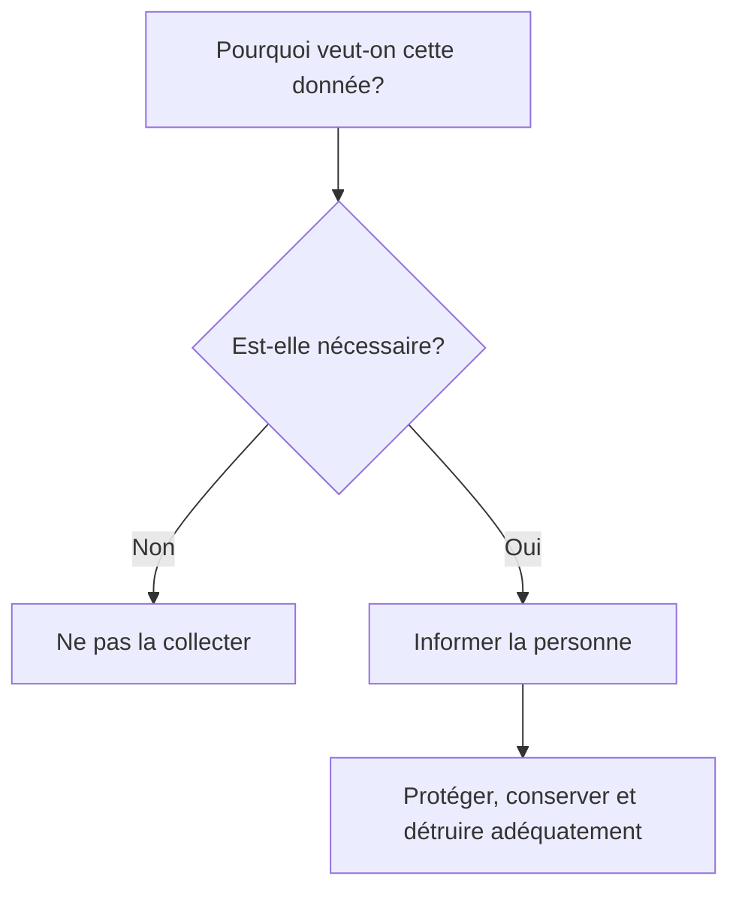
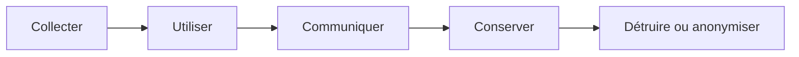
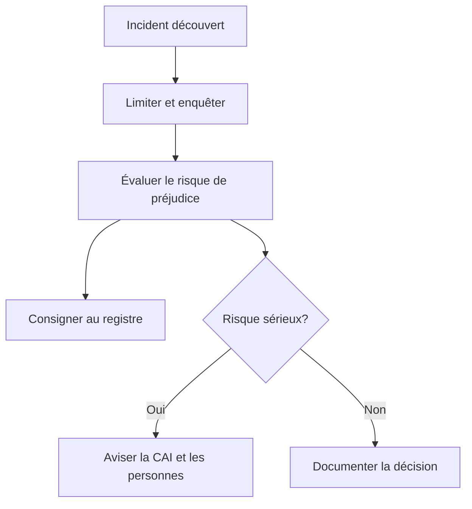
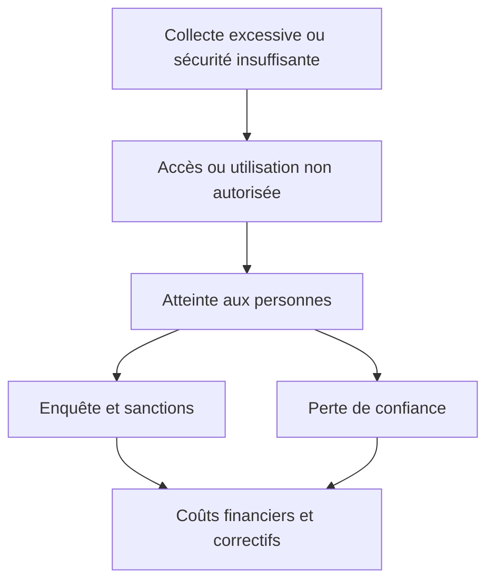
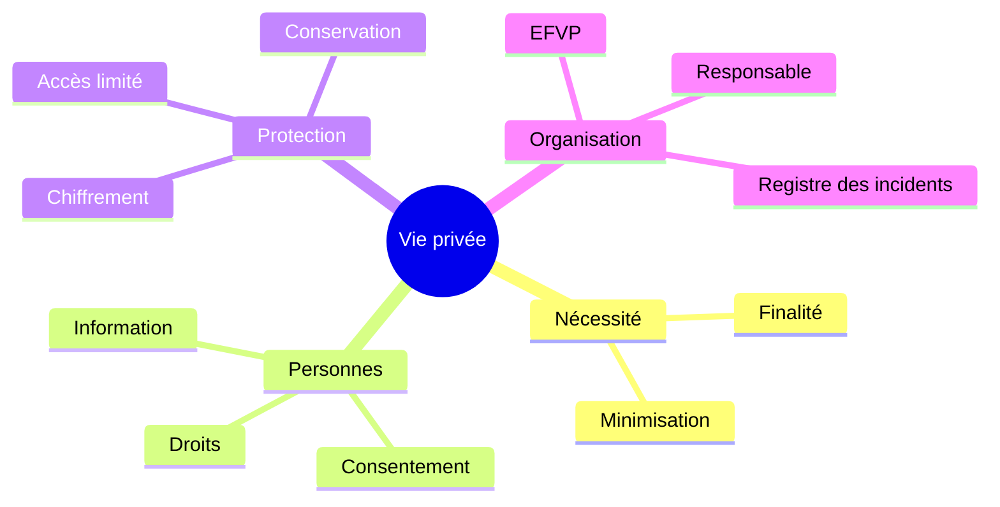

+++
draft = false
title = '📘 Survol des lois sur la vie privée applicables à la gestion des données'
weight = 90
+++


## 1. Définition essentielle

Un **renseignement personnel** est un renseignement qui concerne une personne physique et permet, directement ou indirectement, de l’identifier. Cela inclut le nom, l’adresse, l’e-mail, le numéro de téléphone, le numéro d’assurance sociale, les données biométriques (comme les empreintes digitales), l’adresse IP, les préférences en ligne, identifiant de connexion, données de localisation, combinaison de variables qui rendent quelqu’un reconnaissable, etc.


> En pratique : dès qu’on manipule des données **liées à une personne identifiable**, les lois sur la vie privée s’appliquent.

- **Exemple** : Si on collecte des réponses d’un sondage en ligne avec des informations telles que le nom et l’e-mail, ces informations sont considérées comme des données personnelles.


Un renseignement est **sensible** lorsque sa nature - médicale, biométrique ou autrement intime - ou le contexte de son utilisation suscite un haut degré d’attente raisonnable en matière de vie privée.

Exemples de renseignements sensibles :

- renseignements médicaux;
- données biométriques;
- informations financières détaillées;
- localisation précise et historique de déplacements;
- informations révélant des habitudes intimes;
- combinaison de données pouvant entraîner de la discrimination ou un préjudice important.

La sensibilité influence notamment :

- la forme du consentement;
- les mesures de sécurité attendues;
- la durée de conservation;
- l’évaluation du risque lors d’un incident.


### Mise en situation - Est-ce vraiment une donnée personnelle?

Une application collecte les informations suivantes :

| Donnée | Renseignement personnel? | Pourquoi? |
|---|:---:|---|
| Nom complet | Oui | Identifie directement une personne |
| Courriel nominatif | Oui | Permet généralement d’identifier ou de joindre une personne |
| Adresse IP | Souvent | Peut permettre d’identifier indirectement un utilisateur |
| Identifiant de connexion | Oui | Est associé à un compte ou à une personne |
| Température moyenne d’un bâtiment | Généralement non | Ne concerne pas nécessairement une personne identifiable |
| Température d’un bureau associée à un employé | Possiblement | Le contexte relie la mesure à une personne |
| Historique d’occupation d’un local | Possiblement | Peut révéler la présence et les habitudes d’individus |
| Données entièrement anonymisées | Non, si l’anonymisation est réelle | Il ne doit plus être raisonnablement possible d’identifier une personne |

> **Question éclair :** une donnée technique peut-elle devenir personnelle lorsqu’on la combine à une autre table?

{}
Oui. Un identifiant de capteur, une adresse IP ou une position peuvent sembler anonymes isolément. Une table de correspondance, un horaire ou un journal de connexion peut toutefois permettre de relier ces données à une personne.
{}

## 2. Pourquoi encadrer les données?

Une fuite de données ne cause pas seulement un problème technique. Elle peut entraîner :

- du vol d’identité;
- de la fraude;
- de la discrimination;
- de la surveillance non désirée;
- une atteinte à la réputation;
- une perte de confiance;
- des sanctions et des recours juridiques.

La vie privée ne consiste donc pas simplement à « cacher les données ». Elle vise à donner aux personnes un contrôle raisonnable sur les renseignements qui les concernent.

### Trois questions avant toute collecte



> La meilleure façon de protéger une donnée inutile est de ne pas la recueillir.

## 3. Les grands principes à retenir

Les lois utilisent des formulations différentes, mais elles reposent sur des idées communes.

| Principe | Question à se poser | Exemple technique |
|---|---|---|
| Finalité | Pourquoi collecte-t-on cette donnée? | Documenter l’objectif de chaque champ |
| Minimisation | Est-elle réellement nécessaire? | Ne pas demander la date de naissance pour une simple infolettre |
| Consentement | La personne comprend-elle ce qu’elle accepte? | Demande distincte, claire et liée à une fin précise |
| Transparence | La personne sait-elle ce qui arrive à ses données? | Avis de confidentialité lisible |
| Exactitude | La donnée est-elle correcte et à jour? | Mécanisme de rectification |
| Accès limité | Qui a réellement besoin de la donnée? | Rôles et principe du moindre privilège |
| Sécurité | Les protections correspondent-elles au risque? | TLS, chiffrement, contrôles d’accès et journaux |
| Conservation limitée | Quand doit-on supprimer la donnée? | Calendrier de conservation et suppression automatisée |
| Responsabilité | Peut-on démontrer nos pratiques? | Politiques, registre, décisions et formations documentés |


### Le cycle de vie des renseignements



La protection doit être prévue à **chaque étape**, pas seulement au moment du stockage.

#### Activité

Pour une application connue, choisir une donnée personnelle et compléter :

| Étape | Décision à documenter |
|---|---|
| Collecte | Pourquoi cette donnée est-elle nécessaire? |
| Utilisation | Qui peut l’utiliser et dans quel but? |
| Communication | Est-elle transmise à un fournisseur ou hors Québec? |
| Conservation | Pendant combien de temps? |
| Fin de vie | Sera-t-elle détruite ou anonymisée? |

{}
La donnée personnelle choisie est la localisation précise de l’utilisateur pendant une course.
| Étape | Décision à documenter |
|---|---|
| Collecte | La localisation est nécessaire pour déterminer le point de départ, trouver un chauffeur à proximité, calculer l’itinéraire et suivre la course. La collecte devrait être limitée aux moments où ces fonctions sont utilisées. |
| Utilisation | Le passager, le chauffeur assigné et certains services internes autorisés peuvent l’utiliser pour réaliser la course, assurer la sécurité, calculer le prix et traiter une plainte. Elle ne devrait pas être utilisée à d’autres fins sans justification ou consentement approprié. |
| Communication | La localisation est communiquée au chauffeur et peut être traitée par des fournisseurs de cartographie, d’hébergement ou d’analyse. L’organisation doit identifier ces fournisseurs et vérifier si les données sont communiquées ou hébergées hors Québec. |
| Conservation | La localisation détaillée doit être conservée seulement pendant la durée nécessaire à la réalisation de la course, au traitement des plaintes, à la sécurité et aux obligations légales. Une durée précise doit être définie dans un calendrier de conservation. |
| Fin de vie | Lorsque la localisation détaillée n’est plus nécessaire, elle doit être détruite de manière sécuritaire ou anonymisée pour produire des statistiques générales, par exemple sur les temps moyens de déplacement. |

**Risques particuliers :**
La localisation peut révéler :
- le domicile ou le lieu de travail;
- les habitudes de déplacement;
- les heures de présence ou d’absence;
- la fréquentation d’un établissement médical, religieux ou politique;
- les relations entre différentes personnes.
Elle peut donc devenir un renseignement personnel sensible en raison de son contexte d’utilisation.

```
Application fermée
        ↓
La localisation est-elle encore nécessaire?
        ├── Non → arrêter la collecte
        └── Oui → informer clairement l’utilisateur
```
{}

## 4. Cadre québécois et canadien
### 4.1 Au Québec : ce qu’il faut surtout retenir

La **Loi 25** a modernisé les lois québécoises applicables aux renseignements personnels. Les obligations exactes diffèrent entre le secteur privé et les organismes publics, mais plusieurs thèmes sont communs.

#### Responsable de la protection des renseignements personnels

L’organisation doit identifier une personne responsable. Dans une entreprise, cette fonction revient par défaut à la personne ayant la plus haute autorité, qui peut la déléguer par écrit. Son titre et ses coordonnées doivent être rendus publics.

#### Transparence au moment de la collecte

La personne doit notamment pouvoir comprendre :

- les fins et les moyens de la collecte;
- ses droits d’accès et de rectification;
- son droit de retirer son consentement lorsque celui-ci constitue le fondement applicable;
- les tiers concernés dans les situations prévues;
- la possibilité que les renseignements soient communiqués à l’extérieur du Québec.

L’information doit être présentée dans des termes simples et clairs.

#### Consentement

Lorsqu’un consentement est requis, il doit notamment être manifeste, libre, éclairé, donné à des fins précises et demandé séparément pour chaque fin. Une demande écrite doit être présentée distinctement des autres informations.

> Un bouton « J’accepte tout » ne rend pas automatiquement une pratique conforme.

#### Protection de la vie privée dès la conception

Pour un produit ou un service technologique offert au public, les paramètres de confidentialité doivent généralement offrir par défaut le plus haut niveau de confidentialité, sans intervention de la personne.

En développement, cela signifie notamment :

- désactiver par défaut les collectes facultatives;
- limiter les propriétés retournées par l’API;
- appliquer le moindre privilège;
- définir la conservation avant la mise en production;
- éviter les journaux contenant des renseignements inutiles.

#### Évaluation des facteurs relatifs à la vie privée - EFVP

Une EFVP doit notamment être réalisée :

- pour un projet d’acquisition, de développement ou de refonte d’un système d’information ou d’une prestation électronique de services impliquant des renseignements personnels;
- avant de communiquer des renseignements personnels à l’extérieur du Québec.

L’analyse doit être proportionnée à la sensibilité, à la finalité, à la quantité, à la répartition et au support des renseignements.

#### Incidents de confidentialité

L’organisation doit tenir un registre des incidents. Lorsqu’un incident présente un **risque de préjudice sérieux**, elle doit aviser la Commission d’accès à l’information et les personnes concernées.



#### Droits des personnes

Selon la loi et la situation, une personne peut notamment demander :

- l’accès à ses renseignements;
- la rectification de renseignements inexacts;
- des informations sur leur utilisation ou leur communication;
- le retrait de son consentement, lorsque cela s’applique;
- la portabilité de certains renseignements informatisés recueillis auprès d’elle;
- la cessation de diffusion ou la désindexation dans les conditions prévues par la loi.

> Au Québec, le « droit à l’oubli » n’est pas un droit général permettant d’exiger la suppression de toute donnée. La loi prévoit plutôt des mécanismes précis, notamment la cessation de diffusion ou la désindexation lorsque leurs conditions sont remplies.

Le droit à la portabilité est en vigueur depuis le **22 septembre 2024** pour les renseignements visés.

### 4.2 Au Canada : LPRPDE / PIPEDA

La LPRPDE repose sur dix principes d’équité dans le traitement de l’information :

1. responsabilité;
2. détermination des fins;
3. consentement;
4. limitation de la collecte;
5. limitation de l’utilisation, de la communication et de la conservation;
6. exactitude;
7. mesures de sécurité;
8. transparence;
9. accès individuel;
10. possibilité de porter plainte.

Une organisation ne peut recueillir, utiliser ou communiquer des renseignements personnels qu’à des fins qu’une personne raisonnable jugerait acceptables dans les circonstances.


## 5. Les cadres internationaux en un coup d’œil

Il n’est pas nécessaire de mémoriser toutes les lois étrangères. Il faut surtout reconnaître que l’offre de services à l’extérieur du Québec peut ajouter des obligations.

| Cadre | Idée distinctive à reconnaître |
|---|---|
| RGPD - Union européenne | Bases juridiques, droits étendus, responsabilisation et portée extraterritoriale possible |
| CCPA/CPRA - Californie | Droit de savoir, de corriger, de supprimer dans certaines conditions et de refuser certaines ventes ou certains partages |
| HIPAA - États-Unis | Protection sectorielle de certaines informations de santé par des entités visées |
| Privacy Act - Australie | Principes australiens de protection de la vie privée et règles de communication transfrontalière |
| ISO/IEC 27001 | Norme de gestion de la sécurité de l’information; ce n’est pas une loi |

### Question éclair

Une entreprise québécoise place sa base de données chez un fournisseur infonuagique aux États-Unis. Est-ce seulement une décision technique?

{}

Non. Il faut notamment déterminer quels renseignements sont communiqués hors Québec, réaliser l’EFVP applicable, évaluer la protection offerte et encadrer la communication par une entente écrite respectant les exigences applicables.


{}

## 6. Exemples d’atteintes à la vie privée

Les incidents suivants montrent qu’une mauvaise gestion des renseignements personnels peut entraîner des sanctions financières, des recours judiciaires et une perte importante de confiance.

| Organisation | Incident | Données ou personnes concernées | Conséquences | Leçon à retenir |
|---|---|---|---|---|
| 🔵 **Facebook / Cambridge Analytica** - 2018 | Des données provenant de profils Facebook ont été utilisées pour établir des profils psychologiques et cibler des communications politiques. | Des dizaines de millions d’utilisateurs | En 2019, Facebook a accepté une sanction de **5 milliards $ US** et de nouvelles obligations de gouvernance de la vie privée. Cette sanction concernait plus largement le non-respect des engagements de Facebook en matière de confidentialité. | Le consentement doit être réel, compréhensible et limité à une finalité précise. Une organisation demeure responsable de l’utilisation des données par ses partenaires. |
| 🔴 **Google** - 2019 | Les renseignements sur le traitement des données étaient dispersés et le consentement relatif à la personnalisation publicitaire n’était pas considéré comme valide. | Utilisateurs des services Google en Europe | La CNIL a imposé une amende de **50 millions €** pour manque de transparence, information insuffisante et absence de consentement valide. | Une politique de confidentialité doit être accessible et compréhensible. Le consentement ne doit pas être vague ou regroupé avec plusieurs finalités. |
| 🟠 **Equifax** - 2017 | Une cyberattaque a exposé des renseignements permettant notamment le vol d’identité et la fraude. | Environ **147 millions de personnes** | L’entente globale prévoyait un paiement minimal de **575 millions $ US**, pouvant atteindre **700 millions $ US**. | Les renseignements très sensibles exigent des correctifs rapides, du chiffrement, une surveillance continue et un plan de réponse aux incidents. |
| 🟣 **British Airways** - 2018 | Une cyberattaque a compromis des renseignements personnels et financiers transmis par les clients sur le site et l’application de la compagnie. | Plus de **400 000 clients** | L’amende finale imposée en 2020 a été de **20 millions £**. Le montant de **183,39 millions £** annoncé en 2019 constituait une intention initiale de sanction, et non l’amende définitive. | Les applications Web doivent faire l’objet de contrôles de sécurité continus. La sécurité doit être intégrée dès la conception. |
| 🟢 **Capital One** - 2019 | Une configuration inadéquate de l’environnement infonuagique a permis l’accès non autorisé à des données de clients. | Plus de **100 millions de personnes** aux États-Unis et au Canada | L’OCC a imposé une sanction de **80 millions $ US**. Capital One a également conclu une entente de **190 millions $ US** dans le cadre de recours de clients. | Le fournisseur infonuagique ne remplace pas les responsabilités de l’organisation : les permissions, les configurations et les accès doivent être régulièrement vérifiés. |
| 🟡 **H&M** - 2020 | L’entreprise conservait des notes détaillées sur la santé, la situation familiale, les croyances et la vie privée de certains employés. | Employés d’un centre de services en Allemagne | L’autorité de Hambourg a imposé une amende de **35,3 millions €**. | Les renseignements des employés doivent être protégés au même titre que ceux des clients. Seules les données nécessaires à une finalité légitime devraient être recueillies. |

### Ce que ces incidents ont en commun



{}
Une atteinte à la vie privée ne se limite pas à un piratage. Elle peut également résulter d’une collecte excessive, d’un consentement invalide, d’une mauvaise configuration, d’un partage non autorisé ou d’une surveillance abusive.
{}


### Questions de réflexion

Choisir l’un des incidents et déterminer :

1. Quelle donnée aurait dû être mieux protégée?
2. Quelle mesure préventive aurait pu réduire le risque?
3. L’incident relève-t-il principalement de la **conformité**, de la **cybersécurité**, de la **gouvernance des données**, ou de plusieurs de ces dimensions?
4. Quel serait l’impact d’un incident semblable sur un cégep ou une API comme `energy-api`?


## 7. Mise en situation - Un incident survient

Un fichier contenant les courriels, les rôles et l’historique de connexion des opérateurs est envoyé à la mauvaise personne.

### Que doit-on faire en premier?

Remettre les actions dans un ordre logique :

- documenter les faits;
- récupérer ou faire détruire le fichier lorsque possible;
- prévenir la personne responsable de la protection des renseignements personnels;
- limiter l’accès;
- déterminer les renseignements et les personnes concernés;
- évaluer le risque de préjudice;
- transmettre les avis requis;
- corriger la cause et prévenir la répétition.

> Il ne faut pas attendre de connaître tous les détails avant de signaler l’incident à l’interne et de commencer à le contenir.

### Risque de préjudice sérieux

L’évaluation tient notamment compte :

- de la sensibilité des renseignements;
- des conséquences appréhendées;
- de la probabilité qu’ils soient utilisés à des fins préjudiciables;
- du nombre de personnes touchées et du contexte.

Tous les incidents doivent être traités et consignés selon les exigences applicables. Les avis externes dépendent notamment du niveau de risque prévu par la loi.


## 8. Vérification rapide des connaissances

[Participer à ce petit quiz Wooclap](https://app.wooclap.com/DKFUPSF/questionnaires/6abea7d8cafc08adb624194e)


## 9. Liste de vérification pour un projet informatique

### Avant de collecter

- [ ] La finalité est précise et documentée.
- [ ] Chaque donnée est nécessaire.
- [ ] Le renseignement personnel et son niveau de sensibilité sont identifiés.
- [ ] L’avis et le consentement nécessaires sont prévus.
- [ ] L’EFVP requise est réalisée suffisamment tôt.

### Pendant l’utilisation

- [ ] Les accès suivent le principe du moindre privilège.
- [ ] Les environnements de développement utilisent des données fictives ou adéquatement dépersonnalisées.
- [ ] Les communications à des tiers sont connues et encadrées.
- [ ] Les données en transit et au repos sont protégées selon leur sensibilité.
- [ ] Les journaux ne contiennent pas inutilement des renseignements personnels ou des secrets.

### À la fin du cycle

- [ ] Une durée de conservation est définie.
- [ ] La destruction est sécuritaire et vérifiable.
- [ ] L’anonymisation, lorsqu’elle est utilisée, respecte les exigences applicables.
- [ ] Les sauvegardes sont incluses dans la stratégie de fin de vie.
- [ ] Les demandes d’accès, de rectification et de portabilité peuvent être traitées.


## Synthèse visuelle



### Les cinq réflexes professionnels

1. **Justifier** chaque donnée collectée.
2. **Informer** clairement les personnes.
3. **Limiter** les accès, les usages et la conservation.
4. **Protéger** selon la sensibilité et le contexte.
5. **Documenter** les décisions et les incidents.


## Ressources officielles

- [Commission d’accès à l’information du Québec - Principaux changements apportés par la Loi 25](https://www.cai.gouv.qc.ca/protection-renseignements-personnels/sujets-et-domaines-dinteret/principaux-changements-loi-25)
- [LégisQuébec - Loi sur la protection des renseignements personnels dans le secteur privé](https://www.legisquebec.gouv.qc.ca/fr/document/lc/P-39.1)
- [Commissariat à la protection de la vie privée du Canada - Dix principes de la LPRPDE](https://www.priv.gc.ca/fr/sujets-lies-a-la-protection-de-la-vie-privee/lois-sur-la-protection-des-renseignements-personnels-au-canada/la-loi-sur-la-protection-des-renseignements-personnels-et-les-documents-electroniques-lprpde/p_principle/)
- [Ministère de la Justice du Canada - LPRPDE](https://laws-lois.justice.gc.ca/fra/lois/P-8.6/)
- [Commission européenne - Protection des données dans l’Union européenne](https://commission.europa.eu/law/law-topic/data-protection/data-protection-eu_fr)
- [California Department of Justice - CCPA](https://oag.ca.gov/privacy/ccpa)


