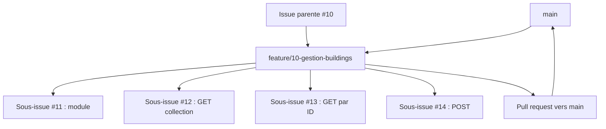

+++
draft = false
title = '🌿 Guide GitHub : Branches, issues et pull requests (PR)'
weight = 202
+++

## Objectif

Ce guide explique comment relier les éléments du **GitHub Project** aux branches, aux commits et aux pull requests.

> Une issue parente représente une fonctionnalité et correspond à une branche `feature`. Ses sous-issues représentent les tâches nécessaires pour réaliser cette fonctionnalité.

## 1. Correspondance générale

| Élément GitHub | Élément Git associé | Rôle |
|---|---|---|
| Issue parente | Branche `feature` | Réaliser une fonctionnalité complète. |
| Sous-issue | Commit ou branche `task` facultative | Réaliser une partie précise de la fonctionnalité. |
| Pull request de tâche | `task` vers `feature` | Intégrer un travail réalisé séparément. |
| Pull request finale | `feature` vers `main` | Intégrer la fonctionnalité complète. |
| Branche `main` | Version stable | Conserver une version fonctionnelle du projet. |

```text
Issue parente  ↔ branche feature
Sous-issue     ↔ commit ou branche task
Feature prête  ↔ pull request vers main
```

## 2. Exemple avec `energy-api`

Issue parente :

```text
#10 — Développer la gestion des bâtiments
```

Branche correspondante :

```text
feature/10-gestion-buildings
```

Sous-issues :

```text
#11 — Créer le module Buildings
#12 — Obtenir la liste des bâtiments
#13 — Obtenir un bâtiment par son identifiant
#14 — Créer un bâtiment
#15 — Tester les endpoints des bâtiments
```

Ces sous-issues décrivent les travaux nécessaires pour terminer `feature/10-gestion-buildings`.

## 3. Convention de nommage

### Branche d'une issue parente

```text
feature/numero-parent-description
```

Exemples :

```text
feature/10-gestion-buildings
feature/20-gestion-sensors
feature/30-collecte-measurements
feature/40-authentification
```

### Branche facultative d'une sous-issue

```text
task/numero-sous-issue-description
```

Exemples :

```text
task/11-module-buildings
task/12-lister-buildings
task/14-creer-building
task/15-tester-buildings
```

Une branche `task` est utile lorsque :

- plusieurs personnes travaillent en parallèle;
- la tâche doit être révisée séparément;
- le travail risque de déstabiliser la branche `feature`;
- une pull request intermédiaire est souhaitée.

### Autres préfixes

| Préfixe | Utilisation | Exemple |
|---|---|---|
| `feature/` | Fonctionnalité correspondant à une issue parente | `feature/10-gestion-buildings` |
| `task/` | Sous-issue réalisée séparément | `task/12-lister-buildings` |
| `fix/` | Correction indépendante | `fix/27-statut-building` |
| `hotfix/` | Correction urgente de la version stable | `hotfix/52-demarrage-api` |
| `docs/` | Documentation indépendante | `docs/18-guide-endpoints` |
| `chore/` | Configuration ou entretien indépendant | `chore/4-configurer-eslint` |

### Règles d'écriture

- utiliser des minuscules;
- inscrire le numéro de l'issue;
- séparer les mots par des traits d'union;
- choisir une description courte et significative;
- ne pas utiliser d'espaces, d'accents ou de caractères spéciaux;
- ne pas inscrire le nom de la personne dans la branche.

À utiliser :

```text
feature/10-gestion-buildings
task/12-lister-buildings
fix/27-statut-building
```

À éviter :

```text
nouvelle-branche
brancheSara
feature bâtiments
feature/createBuilding
travail-final
```

## 4. Préparer l'issue parente

Avant de créer une branche `feature` :

1. ouvrir l'issue parente dans le GitHub Project;
2. vérifier sa description et ses critères d'acceptation;
3. vérifier que ses sous-issues sont définies;
4. attribuer les responsables au besoin;
5. déplacer l'issue parente à `In progress`;
6. noter son numéro pour nommer la branche.

Exemple dans l'issue parente :

```markdown
## Sous-issues

- [ ] #11 Créer le module Buildings
- [ ] #12 Obtenir la liste des bâtiments
- [ ] #13 Obtenir un bâtiment par son identifiant
- [ ] #14 Créer un bâtiment
- [ ] #15 Tester les endpoints
```

## 5. Créer la branche `feature`

La branche doit partir d'une version à jour de `main` :

```bash
git switch main
git pull origin main
git status
git switch -c feature/10-gestion-buildings
git push -u origin feature/10-gestion-buildings
```

Vérifier la branche active :

```bash
git branch --show-current
```

Résultat attendu :

```text
feature/10-gestion-buildings
```

## 6. Réaliser les sous-issues dans `feature`

Lorsqu'une personne travaille de façon séquentielle, les sous-issues peuvent être réalisées directement dans la branche `feature`.

Pour chaque sous-issue :

1. déplacer la sous-issue à `In progress`;
2. réaliser uniquement le travail demandé;
3. vérifier le résultat;
4. produire un ou plusieurs commits cohérents;
5. pousser les modifications;
6. déplacer la sous-issue à `Done` après sa vérification.

Exemple pour `#12` :

```bash
git switch feature/10-gestion-buildings
git pull origin feature/10-gestion-buildings

# Réalisation du travail

git status
git diff
git add src/buildings
git commit -m "feat(buildings): ajouter la liste des bâtiments refs #12"
git push
```

`refs #12` crée un lien avec la sous-issue sans la fermer automatiquement.

## 7. Utiliser une branche `task`

Si une sous-issue doit être développée séparément, sa branche part de `feature`, et non de `main` :

```bash
git switch feature/10-gestion-buildings
git pull origin feature/10-gestion-buildings
git switch -c task/12-lister-buildings
```

Après le développement :

```bash
git status
git add src/buildings
git commit -m "feat(buildings): ajouter la liste des bâtiments refs #12"
git push -u origin task/12-lister-buildings
```

La pull request de tâche doit cibler la branche parente :

```text
task/12-lister-buildings
          ↓
feature/10-gestion-buildings
```

Elle ne doit pas cibler directement `main`.

### Description de la pull request de tâche

```markdown
## Sous-issue associée

Refs #12

## Branche parente

`feature/10-gestion-buildings`

## Modifications

- ajout de `GET /api/buildings`;
- ajout de la méthode du service;
- ajout des tests associés.

## Vérifications

- [x] L'application compile
- [x] Le lint réussit
- [x] Les tests réussissent
- [x] L'endpoint a été vérifié manuellement
```

Après la révision, on fusionne la branche `task` dans la branche `feature`.

## 8. Convention des commits

Format recommandé :

```text
type(portee): description refs #numero-sous-issue
```

| Type | Utilisation |
|---|---|
| `feat` | Ajouter un comportement ou une fonctionnalité. |
| `fix` | Corriger un comportement. |
| `test` | Ajouter ou modifier des tests. |
| `docs` | Modifier la documentation. |
| `refactor` | Restructurer sans modifier le comportement. |
| `chore` | Modifier la configuration ou effectuer de l'entretien. |

Exemples :

```bash
git commit -m "feat(buildings): créer le module Buildings refs #11"
git commit -m "feat(buildings): ajouter GET par identifiant refs #13"
git commit -m "test(buildings): tester la création refs #15"
```

Un commit doit représenter une modification cohérente et faire référence à la sous-issue concernée.

## 9. Vérifier la fonctionnalité

Avant la pull request finale, toutes les sous-issues doivent être réalisées et intégrées dans `feature`.

```bash
npm run lint
npm run test
npm run test:e2e
npm run build
```

On vérifie également :

- les endpoints avec un outil de requêtes HTTP;
- les méthodes HTTP et les codes de statut;
- les critères d'acceptation de l'issue parente;
- l'absence de secrets et de fichiers `.env` dans le dépôt.

## 10. Actualiser `feature` avec `main`

Si `main` a évolué pendant le développement :

```bash
git switch main
git pull origin main
git switch feature/10-gestion-buildings
git merge main
```

Après la résolution éventuelle des conflits :

```bash
git push
```

On réexécute ensuite les tests.

## 11. Créer la pull request finale

La pull request finale part de `feature` et cible `main` :

```text
feature/10-gestion-buildings
          ↓
         main
```

Titre :

```text
feat(buildings): ajouter la gestion des bâtiments
```

Description suggérée :

```markdown
## Issue parente

Closes #10

## Sous-issues réalisées

- #11 — Création du module Buildings
- #12 — Récupération des bâtiments
- #13 — Récupération d'un bâtiment par son identifiant
- #14 — Création d'un bâtiment
- #15 — Tests des endpoints

## Modifications principales

- ajout du module, du contrôleur et du service Buildings;
- ajout des endpoints de consultation et de création;
- ajout des tests associés.

## Vérifications

- [x] L'application compile
- [x] Le lint réussit
- [x] Les tests unitaires réussissent
- [x] Les tests E2E réussissent
- [x] Les endpoints ont été vérifiés manuellement
- [x] Les critères d'acceptation sont respectés
```

`Closes #10` fermera automatiquement l'issue parente après la fusion dans `main`.

## 12. Fermeture des sous-issues

Pour le suivi pédagogique, on recommande de fermer une sous-issue lorsqu'elle est :

- terminée;
- vérifiée;
- intégrée dans la branche `feature`.

Dans les commits et les pull requests de tâche, on utilise :

```text
refs #12
```

La sous-issue est ensuite fermée manuellement ou déplacée à `Done`. Cette méthode permet de voir la progression avant la fusion finale.

Une autre possibilité consiste à attendre la fusion finale et à ajouter toutes les mentions suivantes dans la pull request vers `main` :

```text
Closes #10
Closes #11
Closes #12
Closes #13
Closes #14
Closes #15
```

Toute l'équipe doit appliquer la même méthode pendant le projet.

## 13. Après la fusion

Après l'approbation et la fusion de la pull request finale :

1. vérifier que l'issue parente est fermée;
2. vérifier que son statut est `Done`;
3. supprimer la branche distante `feature`, si elle n'est plus utile;
4. actualiser la branche locale `main`;
5. supprimer facultativement l'ancienne branche locale.

```bash
git switch main
git pull origin main
git branch -d feature/10-gestion-buildings
```

## Résumé du cycle

```text
1. Sélectionner l'issue parente
2. La déplacer à In progress
3. Créer feature/numero-parent-description depuis main
4. Réaliser les sous-issues dans feature
5. Créer une branche task seulement si nécessaire
6. Fusionner les branches task dans feature
7. Vérifier la fonctionnalité complète
8. Créer une pull request feature vers main
9. Fusionner la pull request
10. Fermer l'issue parente et la déplacer à Done
```

Exemple :



## Liste de vérification

### Issue parente et branche `feature`

- [ ] L'issue parente représente une fonctionnalité complète.
- [ ] Les sous-issues sont définies.
- [ ] L'issue parente est à `In progress`.
- [ ] La branche `feature` contient le numéro de l'issue parente.
- [ ] Elle a été créée à partir de `main` à jour.

### Sous-issues

- [ ] Chaque sous-issue représente une tâche précise.
- [ ] Chaque commit fait référence à la sous-issue concernée.
- [ ] Une branche `task` est utilisée seulement si elle est utile.
- [ ] Elle part de `feature` et sa pull request cible `feature`.

### Pull request finale

- [ ] Toutes les sous-issues sont terminées et intégrées.
- [ ] La branche `feature` est actualisée avec `main`.
- [ ] Le lint, les tests et la compilation réussissent.
- [ ] La pull request part de `feature` et cible `main`.
- [ ] Elle contient `Closes #numero-issue-parente`.
- [ ] Aucun secret ni fichier `.env` n'a été ajouté.

## Règle à retenir

```text
Issue parente    → branche feature
Sous-issue       → commit ou branche task facultative
Branche task     → pull request vers feature
Branche feature  → pull request vers main
Fusion dans main → fermeture de l'issue parente
```
