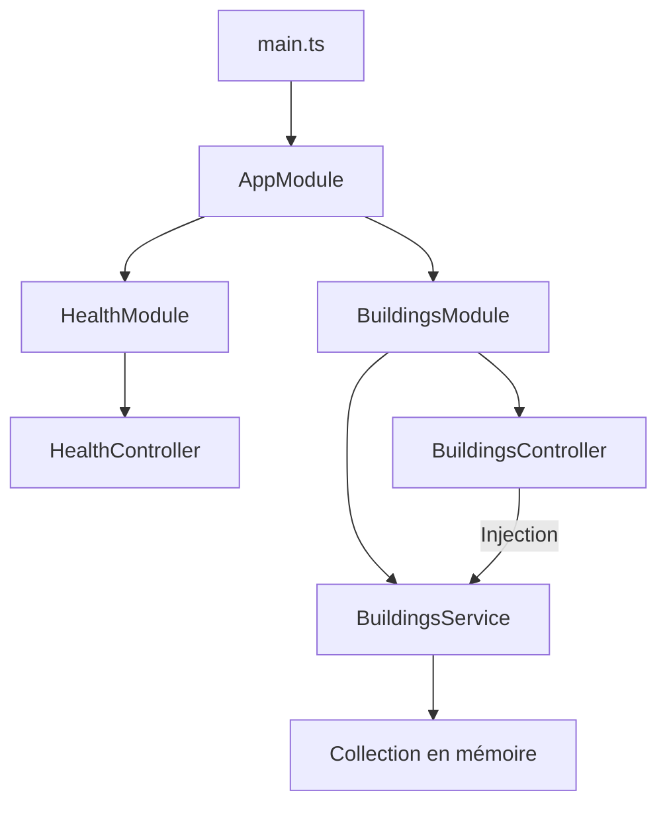
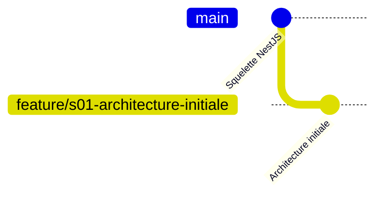
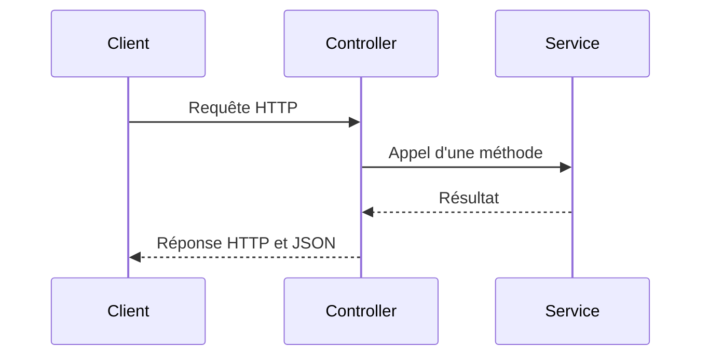

+++
draft = false
title = '🧪 Laboratoire 1 : Révision de NestJS et architecture initiale'
weight = 23
+++

## 1. Contexte

Des bâtiments produisent continuellement des mesures provenant de différents
capteurs. La plateforme devra progressivement recevoir, valider, conserver et
analyser ces données afin de soutenir la prise de décision énergétique.

Avant d'ajouter une base de données, un pipeline ou des conteneurs, on doit
construire une API claire et bien organisée. Ce premier laboratoire porte donc
uniquement sur le dépôt `energy-api`.

On révisera le fonctionnement de NestJS tout en mettant en place une architecture
qui pourra évoluer pendant la session.


## 2. Portée

### Ce qui sera réalisé

- examiner la structure du projet NestJS fourni;
- revoir les modules, contrôleurs, services et l'injection de dépendances;
- configurer le préfixe global `/api`;
- créer une route de santé;
- créer un module fonctionnel `buildings`;
- consulter et ajouter des bâtiments en mémoire;
- vérifier les endpoints avec Postman ou `curl`;
- documenter et versionner le premier incrément.


## 3. Objectifs d'apprentissage

À la fin du laboratoire, on devrait pouvoir :

- expliquer le démarrage d'une application NestJS;
- distinguer le rôle d'un module, d'un contrôleur, d'un service et d'un DTO;
- expliquer le principe de l'injection de dépendances;
- organiser le code par fonctionnalité;
- associer un endpoint aux décorateurs NestJS appropriés;
- séparer la gestion HTTP de la logique applicative;
- appliquer des conventions simples de nommage et de structure;
- tester manuellement une API;
- produire un commit Git cohérent.


## 4. Architecture visée



| Composant | Responsabilité principale | Ne devrait pas |
|---|---|---|
| `main.ts` | Configurer et démarrer l'application | Contenir la logique d'une ressource |
| Module | Regrouper les composants d'une fonctionnalité | Traiter une requête |
| Contrôleur | Recevoir la requête et produire la réponse HTTP | Gérer directement le stockage |
| Service | Appliquer la logique et gérer les données temporaires | Dépendre de la route HTTP |
| DTO | Décrire les données attendues à l'entrée | Contenir l'identifiant produit par le serveur |
| Entité | Représenter une donnée de l'application | Recevoir directement la requête HTTP |


## 5. Résultat attendu

| Méthode | Endpoint | Code | Résultat |
|---|---|---:|---|
| `GET` | `/api/health` | `200` | Retourne l'état de l'API |
| `GET` | `/api/buildings` | `200` | Retourne tous les bâtiments |
| `POST` | `/api/buildings` | `201` | Crée et retourne un bâtiment |

Les données seront conservées temporairement en mémoire et disparaîtront au
redémarrage de l'application.


## 6. Préparation

Les dépendances sont déjà installées dans l'environnement fourni.

```bash
node --version
npm --version
nest --version
git --version
```

```bash
cd ~/projects/energy-api
git status
git remote -v
```

Le laboratoire doit être réalisé uniquement dans `energy-api`.


## 7. Partie 1 - Préparer Git

### 7.1 Contenu initial de la branche `main`

Au début du laboratoire, `main` représente la version de départ officielle du
projet. Elle contient le squelette NestJS fonctionnel et les fichiers de
configuration déjà préparés :

```text
energy-api/
├── src/
│   ├── app.controller.spec.ts
│   ├── app.controller.ts
│   ├── app.module.ts
│   ├── app.service.ts
│   └── main.ts
├── test/
├── .gitignore
├── README.md
├── nest-cli.json
├── package.json
├── package-lock.json
├── tsconfig.build.json
└── tsconfig.json
```

Avant de créer une branche, on doit confirmer que `main` est à jour et qu'elle
ne contient aucune modification locale :

```bash
git switch main
git pull
git status
git log -1 --oneline
```

Le résultat de `git status` devrait notamment indiquer :

```text
On branch main
Your branch is up to date with 'origin/main'.
nothing to commit, working tree clean
```

On ne modifie et on ne valide aucun travail directement dans `main` pendant ce
laboratoire. Elle demeure le point de référence stable.

### 7.2 Vérifier le fichier `.gitignore`

Le fichier `.gitignore` doit au minimum contenir :

```gitignore
# Dépendances
node_modules/

# Fichiers produits par la compilation et les tests
dist/
coverage/
*.tsbuildinfo

# Variables d'environnement et secrets
.env
.env.*
!.env.example

# Journaux
*.log
npm-debug.log*

# Fichiers propres aux outils et au système
.vscode/
.idea/
.DS_Store
```

Vérifier que Git ignore bien les éléments importants :

```bash
git check-ignore -v node_modules
git check-ignore -v dist
git check-ignore -v .env
```

Une ligne du `.gitignore` devrait être affichée pour chaque chemin. Un fichier
déjà suivi par Git ne devient pas automatiquement ignoré lorsqu'on l'ajoute au
`.gitignore`.

À cette étape, on observe seulement le fichier présent dans `main`. S'il est
incomplet, on note les éléments manquants et on le corrigera après avoir créé
la branche de fonctionnalité; on ne modifie pas directement `main`.

### 7.3 Créer la branche de fonctionnalité

À partir de la version à jour de `main` :

```bash
git switch -c feature/s01-architecture-initiale
git branch --show-current
git status
```

Au moment du changement de branche, `feature/s01-architecture-initiale`
contient exactement les mêmes fichiers et le même dernier commit que `main`.
Elle devient ensuite l'espace dans lequel toutes les modifications du
laboratoire seront réalisées.

On peut vérifier qu'il n'existe encore aucune différence :

```bash
git diff main...HEAD
```

Cette commande ne doit rien afficher immédiatement après la création de la
branche.



Issue associée :

```text
[S01][API] Mettre en place l'architecture initiale de l'API NestJS
```


## 8. Partie 2 - Observer le projet NestJS

Démarrer l'application :

```bash
npm run start:dev
```

Dans un second terminal :

```bash
curl -i http://localhost:3000
```

| Fichier | Question à se poser |
|---|---|
| `src/main.ts` | Où l'application est-elle créée et démarrée? |
| `src/app.module.ts` | Quels composants appartiennent au module racine? |
| `src/app.controller.ts` | Quel chemin et quelle méthode HTTP sont exposés? |
| `src/app.service.ts` | Comment le service est-il fourni au contrôleur? |



Questions de révision :

1. Quel décorateur transforme une classe en module?
2. Quel décorateur transforme une classe en contrôleur?
3. Pourquoi un service utilise-t-il `@Injectable()`?
4. Comment NestJS fournit-il une instance du service au contrôleur?
5. Quel fichier représente le point d'entrée de l'application?


## 9. Partie 3 - Nettoyer et configurer l'application

Après avoir observé l'exemple initial, retirer les composants de démonstration
qui ne seront plus utilisés :

```text
src/app.controller.ts
src/app.controller.spec.ts
src/app.service.ts
```

Mettre `AppModule` à jour afin qu'il ne les référence plus.

Dans `src/main.ts`, ajouter :

```typescript
app.setGlobalPrefix('api');
```

Le port doit pouvoir provenir de l'environnement :

```typescript
const port = process.env.PORT ?? 3000;
await app.listen(port);
```

Bonnes pratiques :

- ne pas répéter `/api` dans chaque contrôleur;
- ne pas coder le port à plusieurs endroits;
- limiter `main.ts` à la configuration générale;
- utiliser des routes en minuscules orientées vers les ressources.


## 10. Partie 4 - Créer le module de santé

```bash
nest generate module health
nest generate controller health --no-spec
```

Le contrôleur utilise :

```typescript
@Controller('health')
```

et une méthode :

```typescript
@Get()
```

On évite `@Controller('HealthController')`, qui exposerait le nom de la classe
dans l'URL.

### Endpoint et réponse attendus

```http
GET /api/health
```

```json
{
  "status": "ok",
  "service": "energy-api",
  "timestamp": "2026-08-24T14:30:00.000Z"
}
```

```bash
curl -i http://localhost:3000/api/health
```


## 11. Partie 5 - Concevoir `buildings`

```bash
nest generate module buildings
nest generate controller buildings --no-spec
nest generate service buildings --no-spec
```

Structure à obtenir :

```text
src/buildings/
├── dto/
│   └── create-building.dto.ts
├── entities/
│   └── building.entity.ts
├── buildings.controller.ts
├── buildings.module.ts
└── buildings.service.ts
```

### Entité `Building`

| Propriété | Type | Provenance |
|---|---|---|
| `id` | `number` | Produit par le serveur |
| `name` | `string` | Fourni par le client |
| `address` | `string` | Fourni par le client |
| `yearBuilt` | `number` | Fourni par le client |

### DTO `CreateBuildingDto`

| Propriété | Type |
|---|---|
| `name` | `string` |
| `address` | `string` |
| `yearBuilt` | `number` |

`id` ne doit pas appartenir au DTO de création. Le DTO prépare l'architecture
future; la validation automatique sera ajoutée plus tard.


## 12. Partie 6 - Consulter les bâtiments

Le service possède une collection privée de `Building` et une méthode qui
retourne tous les bâtiments.

Dans le contrôleur :

- injecter `BuildingsService` par le constructeur;
- associer `GET /api/buildings` à la méthode du service;
- ne pas accéder directement à la collection.

Première réponse attendue :

```json
[]
```

Contraintes :

- `@Controller('buildings')` définit la ressource;
- `@Get()` définit l'opération;
- le contrôleur ne contient aucune collection;
- le service ne connaît ni Postman ni `curl`;
- aucun type `any` n'est utilisé.


## 13. Partie 7 - Ajouter un bâtiment

```http
POST /api/buildings
Content-Type: application/json
```

```json
{
  "name": "Pavillon principal",
  "address": "7000, rue Marie-Victorin",
  "yearBuilt": 2005
}
```

Traitement attendu :

1. Le contrôleur reçoit un `CreateBuildingDto`.
2. Il transmet le DTO au service.
3. Le service génère l'identifiant.
4. Il construit et conserve le bâtiment.
5. Le bâtiment créé est retourné.

```json
{
  "id": 1,
  "name": "Pavillon principal",
  "address": "7000, rue Marie-Victorin",
  "yearBuilt": 2005
}
```

NestJS retourne normalement `201 Created` pour `@Post()`.

Bonnes pratiques attendues :

- le client ne choisit pas l'identifiant;
- le contrôleur demeure court;
- la logique de création appartient au service;
- les entrées et sorties possèdent des types explicites;
- les noms des classes sont au singulier et les routes de collection au pluriel;
- la collection ne doit pas être publique.


## 14. Partie 8 - Tester manuellement

| No | Requête | Résultat attendu |
|---:|---|---|
| 1 | `GET /api/health` | `200` et `status: ok` |
| 2 | `GET /api/buildings` | `200` et une liste vide |
| 3 | `POST /api/buildings` | `201` et un bâtiment avec `id: 1` |
| 4 | Deuxième `POST /api/buildings` | Un identifiant différent |
| 5 | `GET /api/buildings` | Les deux bâtiments |
| 6 | Redémarrage de l'API | La collection redevient vide |

```bash
curl -i http://localhost:3000/api/health
curl -i http://localhost:3000/api/buildings
```

```bash
curl -i -X POST http://localhost:3000/api/buildings \
  -H "Content-Type: application/json" \
  -d '{
    "name": "Pavillon principal",
    "address": "7000, rue Marie-Victorin",
    "yearBuilt": 2005
  }'
```

---

## 15. Revue d'architecture

### Questions :
- Où se trouve la route HTTP? 
- Où se trouve la collection? 
- Qui produit l'identifiant? 
- Pourquoi utiliser un DTO? 
- Pourquoi utiliser un module fonctionnel? 
- Pourquoi les données disparaissent-elles? 
- Que remplacera la collection plus tard? 

### Structure finale

```text
src/
├── main.ts
├── app.module.ts
├── health/
│   ├── health.controller.ts
│   └── health.module.ts
└── buildings/
    ├── dto/
    │   └── create-building.dto.ts
    ├── entities/
    │   └── building.entity.ts
    ├── buildings.controller.ts
    ├── buildings.module.ts
    └── buildings.service.ts
```

---

## 16. Documenter et versionner

Mettre `README.md` à jour avec le contexte, les prérequis, la commande
`npm run start:dev`, les endpoints, le stockage temporaire et la structure.

Vérifier le fichier `.gitignore` et l'état du dépôt :

```bash
git status
git diff main...HEAD
```

`node_modules/`, `dist/`, `.env` et les journaux ne doivent pas apparaître
parmi les fichiers à valider.

```bash
git add .
git commit -m "feat: mettre en place l'architecture initiale de l'API"
git push -u origin feature/s01-architecture-initiale
```

---

## 17. Critères de réussite

- [ ] Le travail est réalisé uniquement dans `energy-api`.
- [ ] La branche `main` était à jour et propre avant la création de la branche.
- [ ] La branche de fonctionnalité a été créée à partir de `main`.
- [ ] Le fichier `.gitignore` exclut les dépendances, la compilation et les secrets.
- [ ] L'application démarre avec `npm run start:dev`.
- [ ] Le préfixe global `/api` est configuré.
- [ ] La route est `/api/health`, et non `/api/HealthController/health`.
- [ ] Les fonctionnalités sont organisées en modules.
- [ ] Le contrôleur des bâtiments délègue au service.
- [ ] Le DTO de création ne contient pas `id`.
- [ ] Aucun type `any` n'est utilisé.
- [ ] `GET /api/buildings` retourne une collection.
- [ ] `POST /api/buildings` retourne `201` et un identifiant du serveur.
- [ ] Les endpoints sont testés avec Postman ou `curl`.
- [ ] Le `README.md` est à jour.
- [ ] La modification est associée à une branche et à un commit cohérent.

---

## 18. Questions de synthèse

1. Pourquoi utiliser `health` plutôt que `HealthController` dans la route?
2. Pourquoi la collection appartient-elle au service?
3. Quelle différence existe-t-il entre `Building` et `CreateBuildingDto`?
4. Pourquoi le client ne devrait-il pas produire l'identifiant?
5. Quel avantage procure l'organisation par fonctionnalité?
6. Comment NestJS trouve-t-il le service injecté dans le contrôleur?
7. Quelle limite possède le stockage en mémoire?
8. Quelle prochaine notion permettra de valider automatiquement les données?

---

## 19. Route supplémentaire

Ajouter :

```http
GET /api/buildings/:id
```

Contraintes :

- le service recherche le bâtiment;
- une ressource absente produit une exception HTTP appropriée;
- la logique de recherche n'est pas dupliquée dans le contrôleur.

---

## 20. Bilan

À la fin du laboratoire, `energy-api` possède une première architecture
fonctionnelle et évolutive. On a révisé les mécanismes fondamentaux de NestJS
et appliqué un déroulement Git basé sur une branche de fonctionnalité.

Le prochain incrément pourra approfondir la conception, la validation des
entrées et la documentation de l'API.

---

## Références

- [Premiers pas avec NestJS](https://docs.nestjs.com/first-steps)
- [Modules NestJS](https://docs.nestjs.com/modules)
- [Contrôleurs NestJS](https://docs.nestjs.com/controllers)
- [Providers et services NestJS](https://docs.nestjs.com/providers)
- [Commandes de la CLI NestJS](https://docs.nestjs.com/cli/usages)
