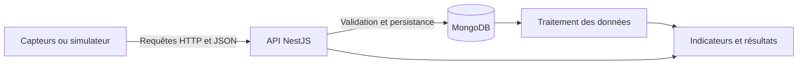
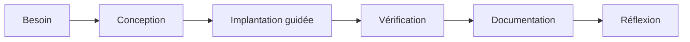

+++
draft = false
title = 'Projet fil conducteur - Plateforme énergétique'
weight = 20
+++

## Un projet construit ensemble

Le projet fil conducteur est un **projet d’apprentissage réalisé progressivement en classe**.

Il nous permettra d’appliquer les notions du cours dans un contexte commun, de
voir comment elles s’intègrent dans une solution complète et de conserver un
exemple fonctionnel auquel nous pourrons nous référer pendant la session.

> **Important :** le projet fil conducteur n’est pas le TP 1, le TP 2 ou le
> TP 3. Il ne constitue pas une remise sommative distincte. Il sert à apprendre,
> à expérimenter et à préparer les notions qui pourront ensuite être évaluées
> dans les TP, l’examen ou l’épreuve finale.

---

## Contexte

Des bâtiments produisent continuellement des mesures provenant de différents
capteurs. Ces données doivent être reçues, validées, conservées et analysées afin
de soutenir la prise de décision énergétique.

Par exemple, une organisation pourrait vouloir :

- connaître la consommation énergétique d’un bâtiment;
- comparer différents bâtiments ou locaux;
- repérer des valeurs anormales;
- suivre l’évolution de la consommation dans le temps;
- produire des indicateurs pour faciliter la prise de décision;
- traiter efficacement un volume important de mesures.

---

## Notre mission

Nous souhaitons développer une plateforme capable :

1. de représenter des bâtiments, des locaux et des capteurs;
2. de recevoir des mesures par une API;
3. de valider et de nettoyer les données reçues;
4. de conserver les données dans MongoDB;
5. de sécuriser les opérations sensibles;
6. de documenter et de tester l’API;
7. de préparer et de transformer les données historiques;
8. de produire des indicateurs et des visualisations;
9. d’appliquer, au besoin, une approche d’analyse automatisée;
10. de mesurer l’efficacité des traitements;
11. de déployer la solution dans un environnement conteneurisé.

---

## Architecture générale visée



L’architecture sera construite progressivement. Nous ne tenterons pas de créer
toute la solution pendant la première semaine.

---

## Principales ressources

La première version de notre modèle pourra contenir les ressources suivantes :

| Ressource | Rôle |
|---|---|
| Bâtiment | Représente un bâtiment suivi par la plateforme |
| Local | Représente une zone ou une pièce d’un bâtiment |
| Capteur | Décrit un dispositif qui produit des mesures |
| Mesure | Contient une valeur, une unité et un horodatage |
| Utilisateur | Représente une personne autorisée à utiliser certaines opérations |
| Indicateur | Présente un résultat calculé à partir des mesures |

Cette structure pourra évoluer lorsque de nouveaux besoins seront découverts.

---

## Progression sur dix semaines

Chaque semaine ajoutera un incrément fonctionnel au projet.

| Semaine | Incrément d’apprentissage | Résultat observable |
|---:|---|---|
| 1 | Serveur NestJS et architecture initiale | L’API démarre et répond à une première requête |
| 2 | Conception et documentation de l’API | Les bâtiments et les locaux sont accessibles par des endpoints documentés |
| 3 | Validation et intégration de MongoDB | Les données sont validées et la base documentaire est connectée |
| 4 | Persistance et requêtes énergétiques | Les capteurs et les mesures sont conservés et interrogés |
| 5 | Sécurité | Les opérations sensibles sont authentifiées et autorisées |
| 6 | Tests et protection des données | Les principaux comportements sont vérifiés automatiquement |
| 7 | Préparation et transformation | Les données historiques sont extraites, nettoyées et transformées |
| 8 | Analyse | Des indicateurs, des visualisations et une analyse automatisée sont produits |
| 9 | Validation et performance | Les résultats et l’efficacité des traitements sont mesurés |
| 10 | Déploiement | La solution intégrée est conteneurisée et déployée |

---

## Fonctionnement en classe

Pour chaque incrément, nous suivrons généralement le même cycle :



### Étape 1 - Comprendre le besoin

Nous commencerons par une situation concrète ou un nouveau besoin de la
plateforme.

### Étape 2 - Concevoir la solution

Nous identifierons les ressources, les endpoints, les données et les composants
NestJS nécessaires.

### Étape 3 - Programmer ensemble

L’implantation sera réalisée de manière guidée. Les choix importants seront
expliqués et discutés avant ou pendant l’écriture du code.

### Étape 4 - Vérifier le résultat

Nous utiliserons progressivement différents outils :

- navigateur ou `curl`;
- Postman;
- Swagger;
- Jest;
- Supertest;
- Newman;
- outils de mesure de performance.

### Étape 5 - Documenter et réfléchir

Nous mettrons à jour la documentation et identifierons :

- ce qui fonctionne;
- les choix effectués;
- les limites de la solution;
- les améliorations possibles;
- les liens avec les contenus essentiels du cours.

---

## Utilisation de GitHub

Le projet sera suivi dans GitHub à l’aide :

- d’un dépôt de code commun;
- d’un GitHub Project;
- d’issues parentes correspondant aux semaines;
- de sous-issues correspondant aux fonctionnalités;
- de branches de travail;
- de commits décrivant les incréments réalisés.

Exemple d’issue :

```text
[S01] Initialiser l’API NestJS
```

Exemple de branche :

```text
feature/s01-api-initiale
```

Exemple de commit :

```text
feat: créer la première API NestJS
```

Le dépôt commun conservera l’évolution de la solution et permettra de revenir
sur les versions précédentes.

---

## Rôle de la classe

Le projet sera réalisé **avec la classe**, et non simplement présenté comme une
solution déjà terminée.

La participation est nécessaire.

Il est recommandé de reproduire les manipulations dans son propre environnement
afin de pouvoir expérimenter et revenir sur le code après la séance.

---

## Premier incrément - Semaine 1

Pendant la première semaine, nous allons :

1. initialiser l’application NestJS;
2. explorer les modules, les contrôleurs et les services;
3. ajouter une route de vérification de l’état;
4. créer une première ressource `buildings`;
5. conserver temporairement les bâtiments en mémoire;
6. vérifier les endpoints avec un client HTTP;
7. documenter l’architecture initiale.

### Résultat attendu

À la fin de la séance, l’application devra pouvoir :

```text
GET  /api/health
GET  /api/buildings
POST /api/buildings
```

La persistance MongoDB, la validation complète et la sécurité seront ajoutées
pendant les incréments suivants.

---

## À retenir

- Le projet fil conducteur est un projet d’apprentissage collectif.
- Il évoluera chaque semaine plutôt que d’être recommencé.
- Il ne correspond pas aux TP 1, 2 ou 3.
- Les notions qui y sont pratiquées pourront toutefois être évaluées.
- Le contexte énergétique permet de relier l’API, les données, la sécurité, les
  tests, l’analyse et le déploiement dans une même solution.
- Le raisonnement, les choix techniques et la capacité à expliquer la solution
  sont aussi importants que le code produit.
