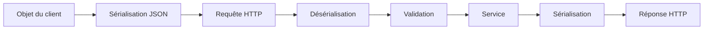

+++
title = "Formats et échange de données d'uen API"
pre = "4."
weight = 5
draft = false
+++

## 1. Pourquoi échanger des données?

Une API relie des applications qui peuvent utiliser des langages différents, fonctionner sur des appareils différents et évoluer séparément.

### Exemple

~~~http
POST /api/v1/buildings HTTP/1.1
Host: localhost:3000
Content-Type: application/json
Accept: application/json

{
  "name": "Pavillon principal",
  "address": "7000, rue Marie-Victorin",
  "yearBuilt": 1965
}
~~~

Cet échange contient une méthode, un chemin, des en-têtes, un corps et un format annoncé.


## 2. Format et transport

HTTP transporte les messages. Un format d’échange définit les règles permettant de représenter des données sous une forme transportable.

| Format | Caractéristiques | Usages fréquents |
|---|---|---|
| JSON | Textuel, compact et largement pris en charge | API REST |
| XML | Textuel, extensible et riche en métadonnées | Systèmes institutionnels |
| CSV | Tabulaire et simple | Importation et analyse |
| YAML | Lisible par une personne | Configuration et spécifications |
| Binaire | Compact et efficace | Images, documents et audio |

### Le format ne définit pas le transport

JSON représente les données. HTTP les transporte.

On peut enregistrer JSON dans un fichier ou le transmettre par HTTP. Inversement, HTTP peut transporter JSON, XML, CSV ou un fichier binaire.

Dans <code>energy-api</code>, on utilise principalement JSON au-dessus de HTTP.

## 3. Le format JSON

JSON signifie JavaScript Object Notation. Malgré son origine, il est indépendant du langage JavaScript.

JSON prend en charge :

| Type | Exemple |
|---|---|
| Chaîne | <code>"Pavillon principal"</code> |
| Nombre | <code>1965</code> ou <code>42.5</code> |
| Booléen | <code>true</code> |
| Valeur nulle | <code>null</code> |
| Objet | <code>{"name": "Pavillon"}</code> |
| Tableau | <code>[{"id": "b1"}, {"id": "b2"}]</code> |

JSON ne possède pas directement de type date, UUID, classe, méthode ou valeur <code>undefined</code>. Ces concepts sont représentés par convention.

### 3.2 Exemple valide

```json
{
  "sensorId": "sen-104",
  "type": "electricity",
  "value": 18.75,
  "unit": "kWh",
  "active": true,
  "tags": ["laboratory", "floor-2"],
  "lastCalibrationAt": null
}
```

**Règles importantes :**

- les noms des propriétés et les chaînes utilisent des guillemets doubles;
- les éléments sont séparés par des virgules;
- le dernier élément n’a pas de virgule;
- <code>true</code>, <code>false</code> et <code>null</code> sont en minuscules;
- les noms d’un même objet devraient être uniques;
- JSON échangé entre systèmes utilise UTF-8;
- l’ordre des propriétés d’un objet ne doit pas porter de signification.
- JSON ne représente pas directement :
  - `undefined`;
  - les commentaires;
  - les fonctions;
  - les objets `Date`;
  - les valeurs `NaN` ou `Infinity`.

### 3.3 Objet et collection

Une ressource :

~~~json
{
  "id": "building-001",
  "name": "Pavillon principal"
}
~~~

Une collection :

~~~json
[
  {
    "id": "building-001",
    "name": "Pavillon principal"
  },
  {
    "id": "building-002",
    "name": "Pavillon des sciences"
  }
]
~~~ 

### 3.4 Conventions JSON du projet

| Élément | Convention retenue | Exemple |
|---|---|---|
| Propriétés | `camelCase` | `recordedAt` |
| Identifiants | Chaînes stables | `"sen-104"` |
| Dates | Chaînes ISO 8601 | `"2026-08-26T14:30:00Z"` |
| Nombres | Valeurs numériques | `18.75` |
| Unités | Propriété distincte | `"unit": "kWh"` |
| Booléens | `true` ou `false` | `"active": true` |
| Valeur inconnue explicite | `null`, si le contrat le prévoit | `"closedAt": null` |

On évite de mélanger valeur et unité :

```json
{
  "consumption": "18.75 kWh"
}
```

On préfère :

```json
{
  "consumption": 18.75,
  "unit": "kWh"
}
```

Cette structure permet d'effectuer des calculs sans analyser une chaîne de caractères.


### 3.5 Dates et heures

Une date échangée dans JSON est généralement représentée par une chaîne :

```json
{
  "recordedAt": "2026-08-26T14:30:00Z"
}
```

Le suffixe `Z` indique l'heure UTC.

Une convention unique évite :

- les ambiguïtés entre jour et mois;
- les erreurs de fuseau horaire;
- les formats différents selon la langue du client.

On évite :

```json
{
  "recordedAt": "26/08/2026 10:30"
}
```

### 3.6 Relations et imbrication

Identifiant seulement :

~~~json
{
  "id": "room-001",
  "buildingId": "building-001",
  "name": "A-101"
}
~~~

Objet imbriqué :

~~~json
{
  "id": "room-001",
  "name": "A-101",
  "building": {
    "id": "building-001",
    "name": "Pavillon principal"
  }
}
~~~

L’imbrication peut réduire le nombre de requêtes, mais augmente la taille des réponses et le couplage. On évite les structures profondément imbriquées.


## 4. Sérialisation et désérialisation

### 4.1 Sérialisation

La sérialisation transforme une structure en mémoire en une représentation transportable.

```ts
const measurement = {
  sensorId: 'sen-104',
  value: 18.75,
};

const json = JSON.stringify(measurement);
```

Résultat :

```json
{"sensorId":"sen-104","value":18.75}
```


### 4.2 Désérialisation

La désérialisation transforme les données reçues en une structure utilisable.

```ts
const measurement = JSON.parse(json);
```

> Désérialiser ne signifie pas valider. Un JSON syntaxiquement valide peut tout de même contenir des données incorrectes pour le domaine.


### 4.3 Sérialisation avec NestJS

Lorsqu'un contrôleur NestJS retourne un objet ou un tableau JavaScript, NestJS le sérialise automatiquement en JSON.

Dans NestJS

À la réception :

1. le serveur lit les octets;
2. le parseur interprète JSON;
3. NestJS remet l’objet au contrôleur avec <code>@Body()</code>;
4. un pipe peut le transformer et le valider;
5. le contrôleur le transmet au service.

Dans l’autre direction, NestJS sérialise la valeur retournée par le contrôleur et l’envoie au client.

```ts
@Get(':id')
findOne(@Param('id') id: string) {
  return {
    id,
    name: 'Pavillon principal',
    city: 'Montréal',
  };
}
```

Réponse :

```json
{
  "id": "bld-001",
  "name": "Pavillon principal",
  "city": "Montréal"
}
```

Il n'est généralement pas nécessaire d'appeler `JSON.stringify()` dans un contrôleur NestJS.

### 4.4 Limites de la désérialisation

Après <code>JSON.parse()</code> :

- une date demeure une chaîne;
- une classe devient un objet ordinaire;
- les méthodes ne sont pas recréées;
- les types TypeScript ne sont pas vérifiés;
- du JSON syntaxiquement valide peut être invalide pour le domaine.

~~~json
{
  "name": "",
  "yearBuilt": -20
}
~~~

Ce document est du JSON valide, mais ne représente pas un bâtiment valide.

## 5. Types de médias et négociation

### 5.1 `Content-Type` et `Accept`

Ces deux en-têtes ne sont pas interchangeables.

| En-tête | Question à laquelle il répond |
|---|---|
| `Content-Type` | Quel est le format du corps envoyé? |
| `Accept` | Quel format de réponse le client souhaite-t-il recevoir? |

Exemple :

```http
POST /api/v1/buildings HTTP/1.1
Host: localhost
Content-Type: application/json
Accept: application/json

{
  "name": "Pavillon principal",
  "city": "Montréal"
}
```

La réponse indique aussi son format :

```http
HTTP/1.1 201 Created
Content-Type: application/json
```

Pour <code>energy-api</code>, on limite volontairement le contrat à JSON.


## 6. Échange complet dans Energy API

### 6.1 Création

~~~http
POST /api/v1/buildings HTTP/1.1
Content-Type: application/json
Accept: application/json

{
  "code": "bld-001",
  "name": "Pavillon central",
  "address": "7000, rue Marie-Victorin",
  "yearBuilt": 1969
}
~~~

Réponse :

~~~http
HTTP/1.1 201 Created
Content-Type: application/json
Location: /api/v1/buildings/5df8c2ac-8abd-4d06-a856-f769821d9e29
~~~

~~~json
{
  "id": "5df8c2ac-8abd-4d06-a856-f769821d9e29",
  "code": "bld-001",
  "name": "Pavillon central",
  "address": "7000, rue Marie-Victorin",
  "yearBuilt": 1969,
  "createdAt": "2026-08-31T18:34:30.450Z",
  "updatedAt": "2026-08-31T18:34:30.450Z"
  
}
~~~

### 6.2 Erreur structurée

~~~http
HTTP/1.1 400 Bad Request
Content-Type: application/problem+json
~~~

~~~json
{
  "type": "about:blank",
  "title": "Bad Request",
  "status": 400,
  "detail": "La requête contient des données invalides.",
  "instance": "/api/v1/buildings",
  "errors": ["Le nom est obligatoire."]
}
~~~

Une erreur est constituée d’un statut et d’un corps prévisible.


## 7. Échanges asynchrones avec `fetch()`

Une requête exige du temps. Le client ne doit pas bloquer toute son exécution pendant l’attente.

### 7.1 Lire une collection

~~~ts
async function loadBuildings() {
  const response = await fetch(
    'http://localhost:3000/api/v1/buildings',
    {
      headers: {
        Accept: 'application/json',
      },
    },
  );

  if (!response.ok) {
    throw await response.json();
  }

  return response.json();
}
~~~

Deux attentes ont lieu :

1. réception des en-têtes;
2. lecture et désérialisation du corps.

`fetch()` ne rejette pas automatiquement sa promesse pour `404` ou `500`. On doit vérifier `response.ok`.

### 7.2 Envoyer JSON

~~~ts
async function createBuilding(building: {
  name: string;
  address: string;
  yearBuilt: number;
}) {
  const response = await fetch(
    'http://localhost:3000/api/v1/buildings',
    {
      method: 'POST',
      headers: {
        'Content-Type': 'application/json',
        Accept: 'application/json',
      },
      body: JSON.stringify(building),
    },
  );

  if (!response.ok) {
    throw await response.json();
  }

  return response.json();
}
~~~

Oublier <code>JSON.stringify()</code> ou <code>Content-Type</code> empêche le serveur d’interpréter correctement le corps.

### 7.3 Trois catégories d’échec

- erreur réseau : aucune réponse HTTP exploitable;
- réponse HTTP d’erreur : <code>response.ok</code> vaut <code>false</code>;
- erreur de lecture : le corps ne peut être lu ou interprété.


## 8. Échanges synchrones et asynchrones

### Dans le programme

- synchrone : l’instruction se termine avant la suivante;
- asynchrone : l’opération peut progresser pendant que le programme effectue d’autres tâches.

### Entre systèmes

- requête-réponse : le client attend le résultat;
- traitement différé : le serveur accepte le travail et répond plus tard;
- événement ou message : un producteur publie une information.

Une fonction utilisant <code>await</code> demeure asynchrone, même si son code se lit séquentiellement.


## 9. Erreurs liées aux échanges

| Situation | Statut possible | Signification |
|---|---:|---|
| JSON mal formé | <code>400</code> | Le corps ne peut être interprété |
| Données JSON invalides | <code>400</code> | Le contrat n’est pas respecté |
| Format non pris en charge | <code>415</code> | <code>Content-Type</code> incompatible |
| Représentation indisponible | <code>406</code> | <code>Accept</code> insatisfait |
| Ressource absente | <code>404</code> | La ressource n’existe pas |
| Conflit | <code>409</code> | L’opération entre en conflit avec l’état |
| Corps trop volumineux | <code>413</code> | La taille dépasse la limite |

Le statut doit décrire la cause réelle de l’échec.


## 10. Pièges fréquents

### Confondre objet JavaScript et JSON

Objet :

~~~ts
const building = { name: 'Pavillon principal' };
~~~

JSON :

~~~json
{"name": "Pavillon principal"}
~~~

### Faire confiance aux types TypeScript

Les types TypeScript disparaissent à l’exécution. Une requête externe doit être validée.

### Retourner la structure de la base de données

La représentation publique ne devrait pas dépendre d’une collection, d’une clé technique ou d’une bibliothèque de persistance.

### Utiliser des dates ambiguës

La valeur <code>09/03/26</code> peut être interprétée différemment selon la région.

### Mélanger les types

Une propriété ne devrait pas être parfois un nombre et parfois une chaîne.

### Utiliser plusieurs formats d’erreur

Un format uniforme simplifie le développement de tous les clients.


## 11. Bonnes pratiques

- utiliser JSON UTF-8;
- appliquer une convention uniforme aux propriétés;
- garder les noms et les types stables;
- représenter les dates selon une convention documentée;
- rendre les unités explicites;
- distinguer propriété absente et <code>null</code>;
- retourner un tableau vide pour une collection vide;
- éviter l’imbrication excessive;
- annoncer le corps avec <code>Content-Type</code>;
- exprimer le format souhaité avec <code>Accept</code>;
- vérifier <code>response.ok</code>;
- distinguer erreurs réseau et HTTP;
- valider après la désérialisation;
- documenter les succès et les erreurs.


## Activité en classe

Analyser :

~~~json
{
  "Building_ID": 90071992547409930,
  "building_name": "Pavillon principal",
  "created": "03/09/26",
  "consumption": 24.8,
  "rooms": null,
  "active": "true"
}
~~~

Questions :

1. L’identifiant risque-t-il de perdre de la précision?
2. Le nommage est-il cohérent?
3. La date est-elle non ambiguë?
4. Quelle est l’unité de consommation?
5. Pourquoi <code>rooms</code> pourrait-il être un tableau vide?
6. Pourquoi <code>active</code> devrait-il être un booléen?


## Application à Energy API

Pour <code>buildings</code> et <code>rooms</code> :

1. définir les représentations JSON;
2. identifier les propriétés générées par le serveur;
3. préciser les propriétés obligatoires;
4. choisir les formats de date et d’identifiant;
5. définir les unités;
6. décider le comportement de <code>null</code>;
7. écrire un exemple de création;
8. écrire une réponse de succès;
9. écrire une erreur Problem Details;
10. tester avec Postman ou <code>curl</code>.

### Décisions retenues

| Élément | Décision |
|---|---|
| Format d’entrée | <code>application/json</code> |
| Format de succès | <code>application/json</code> |
| Format d’erreur | <code>application/problem+json</code> |
| Nommage | <code>camelCase</code> |
| Identifiants | Chaînes UUID |
| Dates et heures | ISO 8601 avec fuseau |
| Collection vide | <code>[]</code> |
| Propriété inconnue | Rejetée |


## Questions de révision

1. Quelle différence existe-t-il entre JSON et HTTP?
2. Quels sont les six types JSON?
3. Quelle différence existe-t-il entre sérialisation et désérialisation?
4. Pourquoi une date devient-elle une chaîne?
5. Quelle différence existe-t-il entre propriété absente et <code>null</code>?
6. Quel en-tête décrit le corps envoyé?
7. Quel en-tête décrit les formats souhaités?
8. Quelle différence existe-t-il entre <code>400</code> et <code>415</code>?
9. Pourquoi vérifier <code>response.ok</code>?
10. Pourquoi le contrat public doit-il être indépendant de la base de données?


## Synthèse



- JSON représente les données.
- HTTP transporte les représentations.
- Les en-têtes décrivent l’échange.
- Les DTO et la validation protègent le contrat.
- La documentation explique le contrat aux consommateurs.

---

## Références

- RFC 8259 — JSON : https://www.rfc-editor.org/rfc/rfc8259.html
- RFC 9110 — HTTP Semantics : https://www.rfc-editor.org/rfc/rfc9110.html
- RFC 9457 — Problem Details : https://www.rfc-editor.org/rfc/rfc9457.html
- NestJS — Controllers : https://docs.nestjs.com/controllers
- NestJS — Serialization : https://docs.nestjs.com/techniques/serialization

